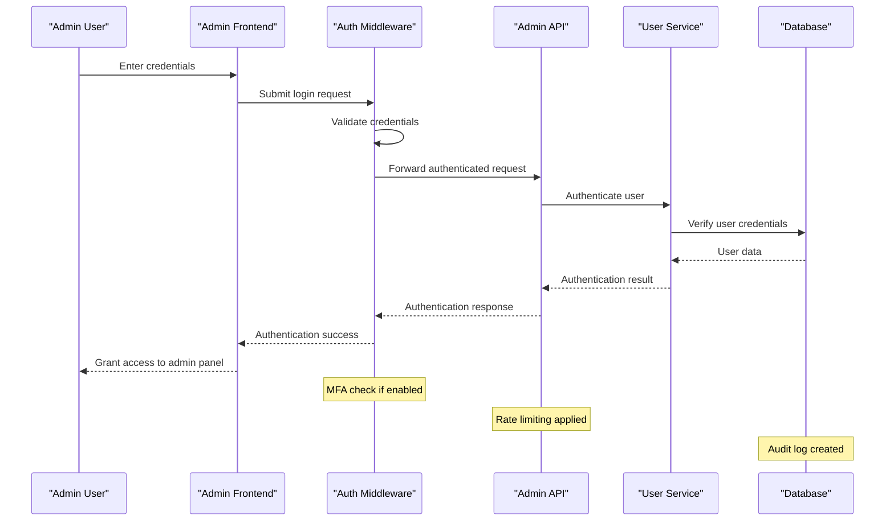
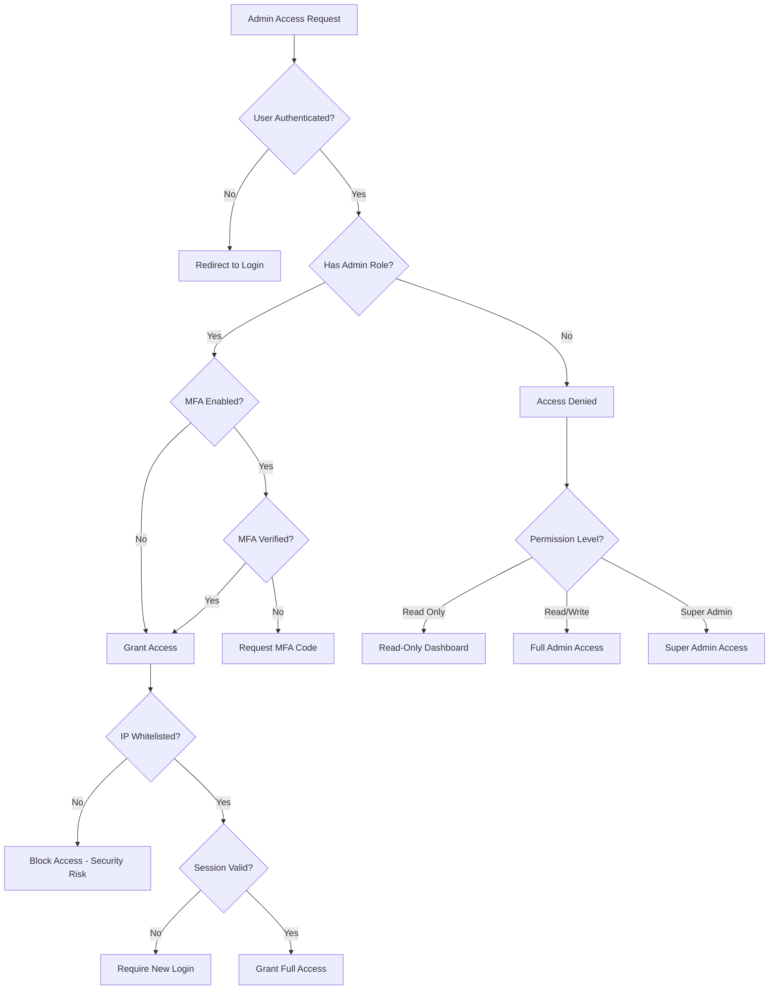
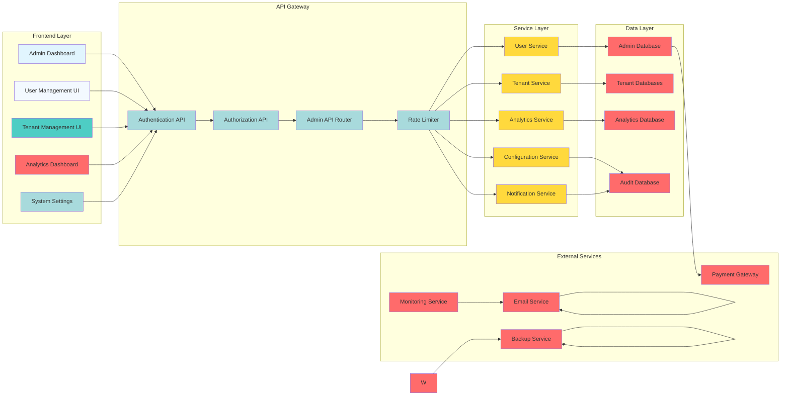

# Advanced Admin Panel

## Executive Summary

This document outlines technical specifications for implementing an advanced admin panel in the SaaS boilerplate. The solution provides comprehensive system management, tenant administration, user management, and business intelligence capabilities while maintaining security and scalability.

## High-Level Functional Requirements

### FR-001: System Administration

- **FR-001.1**: System shall provide centralized administration interface
- **FR-001.2**: Admin shall manage global system configurations and settings
- **FR-001.3**: System shall provide feature flag management and deployment controls
- **FR-001.4**: Admin shall monitor system health, performance, and resource usage
- **FR-001.5**: System shall support system maintenance and backup operations

### FR-002: Tenant Management

- **FR-002.1**: Admin shall create, update, suspend, and delete tenants
- **FR-002.2**: Admin shall manage tenant configurations and customizations
- **FR-002.3**: Admin shall monitor tenant usage, billing, and performance
- **FR-002.4**: Admin shall support tenant migration and data export/import
- **FR-002.5**: Admin shall provide tenant analytics and insights

### FR-003: User Management

- **FR-003.1**: Admin shall manage user accounts across all tenants
- **FR-003.2**: Admin shall support user roles, permissions, and access control
- **FR-003.3**: Admin shall provide user activity monitoring and audit trails
- **FR-003.4**: Admin shall support bulk user operations and data management
- **FR-003.5**: Admin shall manage user authentication and security settings

### FR-004: Analytics & Reporting

- **FR-004.1**: System shall provide comprehensive analytics dashboard
- **FR-004.2**: Admin shall generate custom reports and export data
- **FR-004.3**: System shall provide real-time metrics and alerts
- **FR-004.4**: Admin shall support business intelligence and trend analysis
- **FR-004.5**: System shall provide predictive analytics and forecasting

### FR-005: Security & Compliance

- **FR-005.1**: Admin shall provide security monitoring and incident management
- **FR-005.2**: System shall support compliance reporting and audit management
- **FR-005.3**: Admin shall manage security policies and access controls
- **FR-005.4**: System shall provide vulnerability scanning and risk assessment
- **FR-005.5**: Admin shall support data retention and privacy controls

### FR-006: Customization & Extensibility

- **FR-006.1**: Admin interface shall be customizable and themeable
- **FR-006.2**: System shall support custom dashboard creation and widgets
- **FR-006.3**: Admin shall provide workflow automation and rule engines
- **FR-006.4**: System shall support third-party integrations and extensions
- **FR-006.5**: Admin shall provide API access for custom tooling

## Non-Functional Requirements

### NFR-001: Performance

- **NFR-001.1**: Admin panel shall load within 3 seconds on initial load
- **NFR-001.2**: Dashboard updates shall refresh within 2 seconds
- **NFR-001.3**: System shall support 100+ concurrent admin users
- **NFR-001.4**: Data queries shall complete within 500ms for 95% of requests
- **NFR-001.5**: System shall maintain 99.9% uptime during peak usage

### NFR-002: Security

- **NFR-002.1**: All admin operations shall require multi-factor authentication
- **NFR-002.2**: Admin actions shall be logged with immutable audit trails
- **NFR-002.3**: System shall enforce role-based access control
- **NFR-002.4**: Sensitive data shall be encrypted at rest and in transit
- **NFR-002.5**: System shall detect and prevent privilege escalation attempts

### NFR-003: Usability

- **NFR-003.1**: Admin interface shall be intuitive with minimal training required
- **NFR-003.2**: System shall provide contextual help and documentation
- **NFR-003.3**: Dashboard shall be responsive and accessible
- **NFR-003.4**: System shall support keyboard navigation and screen readers
- **NFR-003.5**: Admin shall provide customizable workspace layouts

### NFR-004: Scalability

- **NFR-004.1**: System shall support 10,000+ managed tenants
- **NFR-004.2**: Admin shall handle 1,000,000+ user accounts
- **NFR-004.3**: Analytics processing shall scale linearly with data volume
- **NFR-004.4**: System shall support horizontal scaling across multiple instances
- **NFR-004.5**: Database performance shall not degrade with admin load

## System Architecture

### C4 Model: Admin Panel Architecture

```mermaid
C4Context(boundary("SaaS Admin Panel")) {
    Person(admin_user, "Admin User")
    Person(tenant_admin, "Tenant Administrator")
    Person(system_admin, "System Administrator")
    Person(auditor, "Auditor")
    Person(developer, "Developer")

    System_Boundary(admin_panel, "Admin Panel") {
        System_Boundary(frontend, "Frontend Application") {
            System(dashboard, "Admin Dashboard") {
                System(widget_engine, "Widget Engine")
                System(layout_manager, "Layout Manager")
                System(theme_manager, "Theme Manager")
            }

            System(user_management, "User Management") {
                System(user_crud, "User CRUD")
                System(role_manager, "Role Manager")
                System(permission_manager, "Permission Manager")
            }

            System(tenant_management, "Tenant Management") {
                System(tenant_crud, "Tenant CRUD")
                System(tenant_config, "Tenant Configuration")
                System(tenant_billing, "Tenant Billing")
            }

            System(analytics, "Analytics & Reporting") {
                System(metrics_collector, "Metrics Collector")
                System(report_generator, "Report Generator")
                System(dashboard_builder, "Dashboard Builder")
            }

            System(system_admin, "System Administration") {
                System(config_manager, "Configuration Manager")
                System(feature_flags, "Feature Flags")
                System(security_monitor, "Security Monitor")
                System(backup_manager, "Backup Manager")
            }
        }

        System_Boundary(backend_api, "Backend API") {
            System(admin_api, "Admin API") {
                System(auth_middleware, "Authentication Middleware")
                System(authorization, "Authorization Service")
                System(rate_limiter, "Rate Limiter")
                System(audit_logger, "Audit Logger")
            }

            System_Boundary(data_layer, "Data Access Layer") {
                System(user_service, "User Service")
                System(tenant_service, "Tenant Service")
                System(analytics_service, "Analytics Service")
                System(config_service, "Configuration Service")
            }

            System_Boundary(external_integrations, "External Integrations") {
                System(payment_gateway, "Payment Gateway")
                System(email_service, "Email Service")
                System(monitoring_service, "Monitoring Service")
                System(backup_service, "Backup Service")
            }
        }

        System_Boundary(database, "Database Layer") {
            System(admin_database, "Admin Database")
                System(tenant_databases, "Tenant Databases")
                System(analytics_database, "Analytics Database")
                System(audit_database, "Audit Database")
        }
    }

    Rel(admin_user, admin_panel, "Uses")
    Rel(tenant_admin, admin_panel, "Manages")
    Rel(system_admin, admin_panel, "Administers")
    Rel(auditor, admin_panel, "Audits")
    Rel(developer, admin_panel, "Develops For")

    Rel(admin_panel, backend_api, "Communicates With")
    Rel(backend_api, data_layer, "Accesses")
    Rel(data_layer, database, "Stores Data In")
}
```

### Class Diagram: Admin Panel Components

```mermaid
classDiagram
    class AdminPanel {
        +dashboard: AdminDashboard
        +userManagement: UserManager
        +tenantManagement: TenantManager
        +analytics: AnalyticsEngine
        +systemAdmin: SystemAdministration
        +themeManager: ThemeManager
        +widgetEngine: WidgetEngine
        +notificationService: NotificationService
        +permissionManager: AdminPermissionManager
        +auditLogger: AuditLogger
    }

    class AdminDashboard {
        +widgets: Map~string, Widget~
        +layout: DashboardLayout
        +theme: Theme
        +refresh(): Promise~void~
        +addWidget(widget: Widget): void
        +removeWidget(widgetId: string): void
        +setLayout(layout: DashboardLayout): void
        +setTheme(theme: Theme): void
    }

    class UserManager {
        +users: UserService
        +roles: RoleService
        +permissions: PermissionService
        +createUser(userData: UserData): Promise~User~
        +updateUser(id: string, updates: Partial~UserData~): Promise~void~
        +deleteUser(id: string): Promise~void~
        +assignRole(userId: string, roleId: string): Promise~void~
        +updatePermissions(userId: string, permissions: Permission[]): Promise~void~
    }

    class TenantManager {
        +tenants: TenantService
        +billing: BillingService
        +configurations: ConfigurationService
        +createTenant(tenantData: TenantData): Promise~Tenant~
        +updateTenant(id: string, updates: Partial~TenantData~): Promise~void~
        +suspendTenant(id: string): Promise~void~
        +deleteTenant(id: string): Promise~void~
        +getUsageMetrics(tenantId: string): Promise~TenantMetrics~
    }

    class AnalyticsEngine {
        +metricsCollector: MetricsCollector
        +reportGenerator: ReportGenerator
        +dashboardBuilder: DashboardBuilder
        +getMetrics(filters: MetricFilters): Promise~Metrics~
        +generateReport(reportType: ReportType, filters: ReportFilters): Promise~Report~
        +createDashboard(config: DashboardConfig): Promise~Dashboard~
    }

    class SystemAdministration {
        +configManager: ConfigurationManager
        +featureFlags: FeatureFlagService
        +securityMonitor: SecurityMonitor
        +backupManager: BackupManager
        +maintenanceMode: MaintenanceMode
        +performMaintenance(operation: MaintenanceOperation): Promise~void~
    }

    class Widget {
        +id: string
        +type: WidgetType
        +config: WidgetConfig
        +data: WidgetData
        +render(): React.ReactNode
        +refresh(): Promise~void~
        +updateConfig(config: Partial~WidgetConfig~): void
    }

    class Role {
        +id: string
        +name: string
        +permissions: Permission[]
        +description: string
        +isSystem: boolean
        +inherits: string[]
    }

    class Permission {
        +id: string
        +name: string
        +resource: string
        +action: string
        +description: string
        +isDangerous: boolean
    }

    AdminPanel --> AdminDashboard
    AdminPanel --> UserManager
    AdminPanel --> TenantManager
    AdminPanel --> AnalyticsEngine
    AdminPanel --> SystemAdministration
    AdminPanel --> ThemeManager
    AdminPanel --> WidgetEngine
    AdminPanel --> NotificationService
    AdminPanel --> AdminPermissionManager
    AdminPanel --> AuditLogger
    UserManager --> UserService
    UserManager --> RoleService
    UserManager --> PermissionService
    TenantManager --> TenantService
    TenantManager --> BillingService
    TenantManager --> ConfigurationService
    AnalyticsEngine --> MetricsCollector
    AnalyticsEngine --> ReportGenerator
    AnalyticsEngine --> DashboardBuilder
```



### Sequence Diagram: Admin User Authentication



### Decision Tree: Admin Access Control



### Interaction Diagram: Admin Data Flow



## Technical Implementation

### Core Interfaces

```typescript
// src/admin/types.ts
export interface AdminPanel {
  dashboard: AdminDashboard
  userManagement: UserManager
  tenantManagement: TenantManager
  analytics: AnalyticsEngine
  systemAdmin: SystemAdministration
  themeManager: ThemeManager
  widgetEngine: WidgetEngine
  notificationService: NotificationService
  permissionManager: AdminPermissionManager
  auditLogger: AuditLogger
}

export interface AdminDashboard {
  widgets: Map<string, Widget>
  layout: DashboardLayout
  theme: Theme
  user: AdminUser
  permissions: Permission[]
  refresh(): Promise<void>
  addWidget(widget: Widget): void
  removeWidget(widgetId: string): void
  setLayout(layout: DashboardLayout): void
  setTheme(theme: Theme): void
}

export interface UserManager {
  users: UserService
  roles: RoleService
  permissions: PermissionService
  createUser(userData: UserData): Promise<User>
  updateUser(id: string, updates: Partial<UserData>): Promise<void>
  deleteUser(id: string): Promise<void>
  assignRole(userId: string, roleId: string): Promise<void>
  updatePermissions(userId: string, permissions: Permission[]): Promise<void>
  bulkImport(users: UserData[]): Promise<BulkImportResult>
  bulkExport(filters: UserFilters): Promise<UserExport>
}

export interface TenantManager {
  tenants: TenantService
  billing: BillingService
  configurations: ConfigurationService
  createTenant(tenantData: TenantData): Promise<Tenant>
  updateTenant(id: string, updates: Partial<TenantData>): Promise<void>
  suspendTenant(id: string): Promise<void>
  deleteTenant(id: string): Promise<void>
  getUsageMetrics(tenantId: string): Promise<TenantMetrics>
  exportData(tenantId: string, format: ExportFormat): Promise<ExportData>
}

export interface AnalyticsEngine {
  metricsCollector: MetricsCollector
  reportGenerator: ReportGenerator
  dashboardBuilder: DashboardBuilder
  getMetrics(filters: MetricFilters): Promise<Metrics>
  generateReport(reportType: ReportType, filters: ReportFilters): Promise<Report>
  createDashboard(config: DashboardConfig): Promise<Dashboard>
}

export interface SystemAdministration {
  configManager: ConfigurationManager
  featureFlags: FeatureFlagService
  securityMonitor: SecurityMonitor
  backupManager: BackupManager
  maintenanceMode: MaintenanceMode
  performMaintenance(operation: MaintenanceOperation): Promise<void>
}
```

### Admin Dashboard Implementation

```typescript
// src/admin/components/AdminDashboard.tsx
export const AdminDashboard: React.FC<AdminDashboardProps> = ({
  user,
  permissions,
  initialLayout,
  initialTheme
}) => {
  const [widgets, setWidgets] = useState<Map<string, Widget>>(new Map());
  const [layout, setLayout] = useState<DashboardLayout>(initialLayout);
  const [theme, setTheme] = useState<Theme>(initialTheme);

  return (
    <div className={`admin-dashboard theme-${theme.name}`}>
      <AdminHeader user={user} onLogout={handleLogout} />

      <AdminSidebar
        permissions={permissions}
        selectedSection={selectedSection}
        onSectionChange={setSelectedSection}
      />

      <main className="admin-main">
        <AdminToolbar
          layout={layout}
          onLayoutChange={setLayout}
          theme={theme}
          onThemeChange={setTheme}
        />

        <WidgetEngine
          widgets={widgets}
          onWidgetAdd={handleWidgetAdd}
          onWidgetRemove={handleWidgetRemove}
          onWidgetUpdate={handleWidgetUpdate}
        />

        <DashboardContent
          layout={layout}
          widgets={widgets}
        />
      </main>

      <AdminFooter />
    </div>
  );
};

const handleWidgetAdd = useCallback((widget: Widget) => {
  setWidgets(prev => new Map(prev.set(widget.id, widget)));
}, []);

const handleWidgetRemove = useCallback((widgetId: string) => {
  setWidgets(prev => {
    const newWidgets = new Map(prev);
    newWidgets.delete(widgetId);
    return newWidgets;
  });
}, []);

const handleWidgetUpdate = useCallback((widgetId: string, updates: Partial<Widget>) => {
  setWidgets(prev => {
    const newWidgets = new Map(prev);
    const existing = newWidgets.get(widgetId);
    if (existing) {
      newWidgets.set(widgetId, { ...existing, ...updates });
    }
    return newWidgets;
  });
}, []);
```

### User Management Implementation

```typescript
// src/admin/components/UserManagement.tsx
export const UserManagement: React.FC<UserManagementProps> = ({
  permissions
}) => {
  const [users, setUsers] = useState<User[]>([]);
  const [selectedUsers, setSelectedUsers] = useState<string[]>([]);
  const [filters, setFilters] = useState<UserFilters>({});
  const [pagination, setPagination] = useState<Pagination>({ page: 1, limit: 50 });

  const {
    data,
    loading,
    error,
    refetch
  } = useUsersQuery(filters, pagination);

  const handleUserCreate = useCallback(async (userData: UserData) => {
    try {
      await userService.createUser(userData);
      refetch();
      showNotification('User created successfully', 'success');
    } catch (error) {
      showNotification(`Failed to create user: ${error.message}`, 'error');
    }
  }, [refetch]);

  const handleUserUpdate = useCallback(async (id: string, updates: Partial<UserData>) => {
    try {
      await userService.updateUser(id, updates);
      refetch();
      showNotification('User updated successfully', 'success');
    } catch (error) {
      showNotification(`Failed to update user: ${error.message}`, 'error');
    }
  }, [refetch]);

  const handleUserDelete = useCallback(async (id: string) => {
    if (!confirm('Are you sure you want to delete this user?')) return;

    try {
      await userService.deleteUser(id);
      refetch();
      showNotification('User deleted successfully', 'success');
    } catch (error) {
      showNotification(`Failed to delete user: ${error.message}`, 'error');
    }
  }, [refetch]);

  const handleBulkAction = useCallback(async (action: BulkAction) => {
    try {
      await userService.bulkAction(selectedUsers, action);
      refetch();
      setSelectedUsers([]);
      showNotification(`${action} completed successfully`, 'success');
    } catch (error) {
      showNotification(`Failed to ${action}: ${error.message}`, 'error');
    }
  }, [selectedUsers, refetch]);

  return (
    <div className="user-management">
      <UserManagementHeader
        onCreate={handleUserCreate}
        onBulkImport={handleBulkImport}
        onExport={handleExport}
      />

      <UserFilters
        filters={filters}
        onChange={setFilters}
      />

      <UserTable
        users={data}
        loading={loading}
        error={error}
        selectedUsers={selectedUsers}
        onSelectionChange={setSelectedUsers}
        onUserUpdate={handleUserUpdate}
        onUserDelete={handleUserDelete}
        permissions={permissions}
      />

      <Pagination
        pagination={pagination}
        onChange={setPagination}
      />
    </div>
  );
};
```

## Configuration Management

### Admin Configuration Schema

```typescript
// src/admin/config/AdminConfig.ts
export const adminConfigSchema: ConfigSchema = {
  type: 'object',
  properties: {
    dashboard: {
      type: 'object',
      properties: {
        defaultLayout: {
          type: 'string',
          enum: ['grid', 'sidebar', 'custom'],
          default: 'sidebar',
        },
        defaultTheme: {
          type: 'string',
          default: 'light',
        },
        widgets: {
          type: 'array',
          items: {
            type: 'object',
            properties: {
              id: { type: 'string' },
              type: { type: 'string', enum: ['analytics', 'users', 'tenants', 'system'] },
              config: { type: 'object' },
            },
          },
        },
      },
    },
    security: {
      type: 'object',
      properties: {
        mfaRequired: { type: 'boolean', default: false },
        sessionTimeout: { type: 'number', default: 3600 }, // 1 hour
        maxLoginAttempts: { type: 'number', default: 5 },
        ipWhitelist: { type: 'array', items: { type: 'string' } },
      },
    },
    features: {
      type: 'object',
      properties: {
        analytics: { type: 'boolean', default: true },
        tenantManagement: { type: 'boolean', default: true },
        userManagement: { type: 'boolean', default: true },
        systemAdmin: { type: 'boolean', default: true },
        customBranding: { type: 'boolean', default: false },
      },
    },
    notifications: {
      type: 'object',
      properties: {
        email: { type: 'object', properties: { enabled: { type: 'boolean', default: true } } },
        slack: { type: 'object', properties: { enabled: { type: 'boolean', default: false } } },
        webhook: { type: 'object', properties: { enabled: { type: 'boolean', default: false } } },
      },
    },
  },
  required: [],
}
```

## Performance Optimization

### Admin Caching Strategy

```typescript
// src/admin/cache/AdminCache.ts
export class AdminCache {
  private cache: CacheProvider
  private metrics: AdminMetrics

  constructor(cacheProvider: CacheProvider) {
    this.cache = cacheProvider
    this.metrics = new AdminMetrics()
  }

  async getUsers(filters: UserFilters): Promise<User[]> {
    const cacheKey = `users:${JSON.stringify(filters)}`
    let users = await this.cache.get(cacheKey)

    if (!users) {
      users = await userService.getUsers(filters)
      await this.cache.set(cacheKey, users, 300) // 5 minutes
      this.metrics.recordCacheMiss('users')
    } else {
      this.metrics.recordCacheHit('users')
    }

    return users
  }

  async getTenantMetrics(tenantId: string): Promise<TenantMetrics> {
    const cacheKey = `tenant_metrics:${tenantId}`
    let metrics = await this.cache.get(cacheKey)

    if (!metrics) {
      metrics = await tenantService.getMetrics(tenantId)
      await this.cache.set(cacheKey, metrics, 600) // 10 minutes
      this.metrics.recordCacheMiss('tenant_metrics')
    } else {
      this.metrics.recordCacheHit('tenant_metrics')
    }

    return metrics
  }

  async invalidateUserCache(): Promise<void> {
    await this.cache.invalidate('users:*')
    this.metrics.recordCacheInvalidation('users')
  }

  async invalidateTenantCache(tenantId: string): Promise<void> {
    await this.cache.invalidate(`tenant_metrics:${tenantId}`)
    await this.cache.invalidate(`tenant:${tenantId}:*`)
    this.metrics.recordCacheInvalidation('tenant')
  }
}
```

## Security Implementation

### Admin Security Framework

```typescript
// src/admin/security/AdminSecurity.ts
export class AdminSecurity {
  private auditLogger: AuditLogger
  private permissionManager: AdminPermissionManager
  private rateLimiter: RateLimiter

  constructor() {
    this.auditLogger = new AuditLogger()
    this.permissionManager = new AdminPermissionManager()
    this.rateLimiter = new RateLimiter()
  }

  async authenticateUser(credentials: AdminCredentials): Promise<AuthResult> {
    const startTime = Date.now()

    try {
      // Check rate limiting
      const rateLimitResult = await this.rateLimiter.checkLogin(credentials.email)
      if (!rateLimitResult.allowed) {
        await this.auditLogger.log({
          event: 'login_rate_limited',
          email: credentials.email,
          ip: getClientIP(),
          timestamp: new Date(),
        })
        return { success: false, reason: 'Rate limit exceeded' }
      }

      // Validate credentials
      const user = await this.validateCredentials(credentials)
      if (!user) {
        await this.auditLogger.log({
          event: 'login_failed',
          email: credentials.email,
          ip: getClientIP(),
          reason: 'invalid_credentials',
          timestamp: new Date(),
        })
        return { success: false, reason: 'Invalid credentials' }
      }

      // Check MFA if required
      if (user.mfaRequired && !credentials.mfaCode) {
        await this.auditLogger.log({
          event: 'mfa_required',
          userId: user.id,
          timestamp: new Date(),
        })
        return { success: false, reason: 'MFA required', mfaRequired: true }
      }

      // Successful authentication
      await this.auditLogger.log({
        event: 'login_success',
        userId: user.id,
        ip: getClientIP(),
        duration: Date.now() - startTime,
        timestamp: new Date(),
      })

      return {
        success: true,
        user,
        token: await this.generateSessionToken(user),
        permissions: await this.permissionManager.getUserPermissions(user.id),
      }
    } catch (error) {
      await this.auditLogger.log({
        event: 'login_error',
        email: credentials.email,
        error: error.message,
        timestamp: new Date(),
      })
      throw error
    }
  }

  async checkPermissions(userId: string, resource: string, action: string): Promise<boolean> {
    const userPermissions = await this.permissionManager.getUserPermissions(userId)
    const requiredPermission = await this.permissionManager.getPermission(resource, action)

    const hasPermission = userPermissions.some(
      (p) => p.resource === resource && p.actions.includes(action)
    )

    await this.auditLogger.log({
      event: 'permission_check',
      userId,
      resource,
      action,
      granted: hasPermission,
      timestamp: new Date(),
    })

    return hasPermission
  }
}
```

## Appendix: Non-Functional Requirements

### Performance Benchmarks

| Metric                 | Target               | Measurement Method      |
| ---------------------- | -------------------- | ----------------------- |
| Dashboard load time    | <3s                  | Performance monitoring  |
| Widget refresh time    | <2s                  | Automated testing       |
| User list loading      | <500ms for 10k users | Database query analysis |
| Report generation time | <10s                 | Performance testing     |
| Concurrent admin users | 100+                 | Load testing            |
| Cache hit rate         | >85%                 | Cache monitoring        |
| Memory usage           | <200MB baseline      | Memory profiling        |

### Security Requirements

| Requirement        | Specification                | Validation             |
| ------------------ | ---------------------------- | ---------------------- |
| Multi-factor auth  | Required for admin access    | Security testing       |
| Role-based access  | Granular permissions         | Access control testing |
| Audit logging      | Complete immutable logs      | Log analysis           |
| Session management | Secure token-based sessions  | Security audit         |
| Data encryption    | AES-256 for sensitive data   | Security scanning      |
| IP whitelisting    | Configurable IP restrictions | Network security       |

### Usability Requirements

| Requirement             | Specification             | Validation          |
| ----------------------- | ------------------------- | ------------------- |
| Interface intuitiveness | <30min to learn           | User testing        |
| Responsive design       | Mobile-first approach     | Device testing      |
| Accessibility           | WCAG 2.1 AA compliance    | Accessibility audit |
| Customization           | User-configurable layouts | Usability testing   |
| Help system             | Contextual assistance     | User feedback       |

### Scalability Requirements

| Requirement           | Target                   | Measurement Method     |
| --------------------- | ------------------------ | ---------------------- |
| Tenant support        | 10,000+                  | Load testing           |
| User management       | 1,000,000+ accounts      | Database performance   |
| Analytics processing  | Real-time metrics        | Performance monitoring |
| Concurrent operations | 1000+ admin users        | Stress testing         |
| Horizontal scaling    | Multiple admin instances | Architecture testing   |

## Future Roadmap Items (10x Improvements)

### Short-term (3-6 months)

1. **AI-Powered Analytics**: Intelligent insights and anomaly detection
2. **Advanced Widget System**: Drag-and-drop dashboard builder
3. **Real-time Collaboration**: Multi-admin user collaboration
4. **Mobile Admin App**: Native mobile administration interface

### Medium-term (6-12 months)

1. **Workflow Automation**: Visual workflow builder with AI integration
2. **Advanced Security**: Biometric authentication and behavioral analysis
3. **Custom Report Builder**: Drag-and-drop report creation interface
4. **API Versioning**: Admin API versioning and deprecation management

### Long-term (12-24 months)

1. **Predictive Analytics**: ML-powered forecasting and recommendations
2. **Voice Interface**: Natural language admin commands
3. **Augmented Reality**: AR-based system visualization and management
4. **Quantum-Safe Security**: Future-proof encryption and security protocols
5. **Autonomous Administration**: AI-driven system management and optimization

## Conclusion

The advanced admin panel will provide enterprise-grade system management capabilities with comprehensive user, tenant, and analytics administration. By implementing the specifications outlined in this document, we can:

- Deliver intuitive and responsive admin interface
- Provide comprehensive user and tenant management
- Offer powerful analytics and reporting capabilities
- Ensure robust security and audit compliance
- Support extensive customization and extensibility
- Scale to support enterprise-level operations

This implementation positions the boilerplate as a leader in admin panel capabilities, providing administrators with powerful tools to manage complex SaaS environments efficiently and securely.
