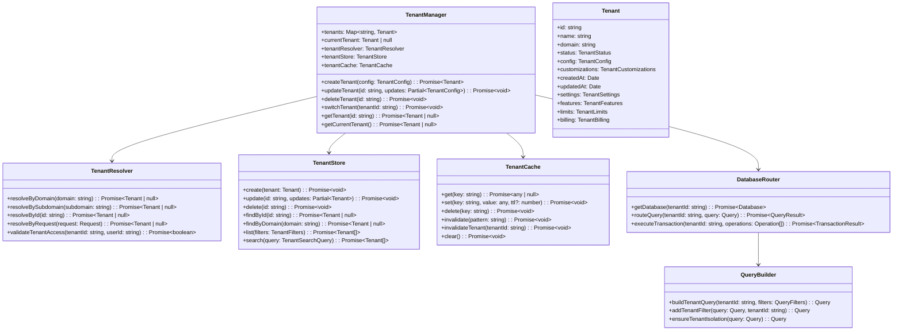
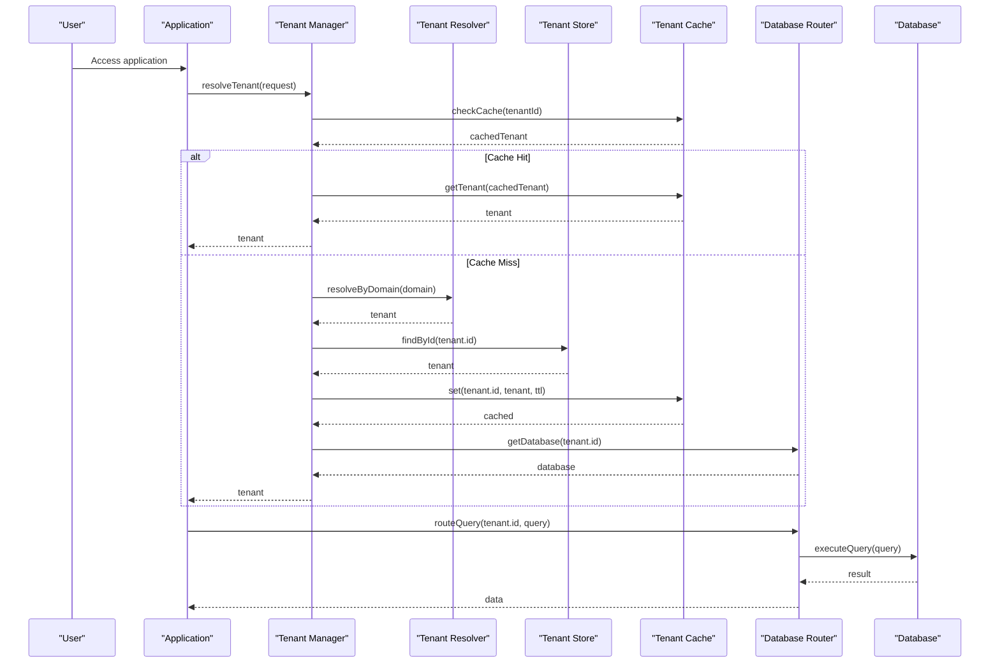
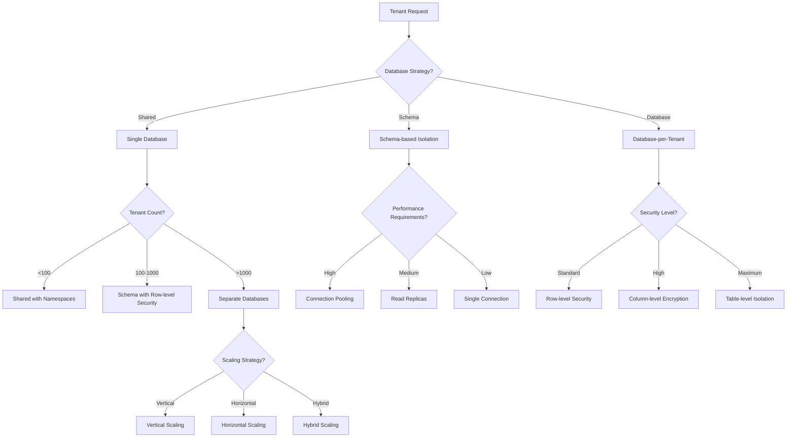
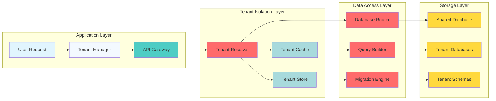

# Advanced Multi-Tenancy

## Executive Summary

This document outlines technical specifications for implementing advanced multi-tenancy capabilities in the SaaS boilerplate. The solution provides complete tenant isolation, customization, and management while maintaining performance and security.

## High-Level Functional Requirements

### FR-001: Tenant Isolation

- **FR-001.1**: System shall provide complete data isolation between tenants
- **FR-001.2**: Each tenant shall have independent database schema or namespace
- **FR-001.3**: Tenant resources shall be logically and physically separated
- **FR-001.4**: Cross-tenant data leakage shall be prevented through architecture
- **FR-001.5**: System shall support tenant-specific customizations without affecting others

### FR-002: Tenant Management

- **FR-002.1**: System shall support dynamic tenant creation and deletion
- **FR-002.2**: Administrators shall manage all tenant configurations
- **FR-002.3**: System shall support tenant suspension and reactivation
- **FR-002.4**: Tenant switching shall be seamless for users with multiple access
- **FR-002.5**: System shall provide tenant usage monitoring and analytics

### FR-003: Customization & White-Labeling

- **FR-003.1**: Each tenant shall customize branding, themes, and domains
- **FR-003.2**: Tenants shall configure feature availability per tenant
- **FR-003.3**: System shall support custom workflows per tenant
- **FR-003.4**: Tenant-specific configurations shall not affect core system
- **FR-003.5**: System shall support tenant-specific API customizations

### FR-004: Performance & Scalability

- **FR-004.1**: System shall support 10,000+ concurrent tenants
- **FR-004.2**: Tenant operations shall not exceed 100ms response time
- **FR-004.3**: System shall provide tenant-level caching strategies
- **FR-004.4**: Database performance shall not degrade with tenant count
- **FR-004.5**: System shall support horizontal scaling for tenant load

### FR-005: Security & Compliance

- **FR-005.1**: Each tenant shall have isolated authentication contexts
- **FR-005.2**: Tenant data shall be encrypted at rest and in transit
- **FR-005.3**: System shall provide tenant-specific audit logs
- **FR-005.4**: Cross-tenant access shall be prevented by default
- **FR-005.5**: System shall support compliance features per tenant (GDPR, HIPAA, etc.)

## Non-Functional Requirements

### NFR-001: Performance

- **NFR-001.1**: Tenant context resolution shall complete within 50ms
- **NFR-001.2**: Database query performance shall not exceed 200ms for 95% of queries
- **NFR-001.3**: Memory usage per tenant shall not exceed 100MB baseline
- **NFR-001.4**: System shall maintain 99.9% uptime with 1000+ tenants

### NFR-002: Security

- **NFR-002.1**: Tenant data isolation shall be cryptographically enforced
- **NFR-002.2**: All tenant operations shall be auditable with immutable logs
- **NFR-002.3**: System shall detect and prevent tenant data exfiltration attempts
- **NFR-002.4**: Tenant isolation shall survive database compromise scenarios
- **NFR-002.5**: System shall support tenant-specific encryption keys

### NFR-003: Scalability

- **NFR-003.1**: System shall support adding 100 new tenants per hour
- **NFR-003.2**: Tenant database size shall not affect overall system performance
- **NFR-003.3**: System shall support automatic tenant resource scaling
- **NFR-003.4**: Cross-tenant operations shall be rate-limited to prevent abuse
- **NFR-003.5**: System shall support tenant migration between database partitions

### NFR-004: Maintainability

- **NFR-004.1**: Tenant configuration changes shall not require system restarts
- **NFR-004.2**: System shall support tenant-specific feature flags
- **NFR-004.3**: Tenant isolation shall be maintained through system updates
- **NFR-004.4**: System shall provide tenant debugging and monitoring tools
- **NFR-004.5**: Tenant data migration shall be automated and reversible

## System Architecture

### C4 Model: Multi-Tenant Architecture

```mermaid
C4Context(boundary("SaaS Multi-Tenant System")) {
    Person(user, "Application User")
    Person(tenant_admin, "Tenant Administrator")
    Person(system_admin, "System Administrator")
    Person(developer, "Developer")

    System_Boundary(multi_tenant_system, "Multi-Tenant Application") {
        System(application_core, "Application Core") {
            System(tenant_manager, "Tenant Manager") {
                System(tenant_resolver, "Tenant Resolver")
                System(tenant_store, "Tenant Store")
                System(tenant_cache, "Tenant Cache")
            }
            System(user_manager, "User Manager") {
                System(user_store, "User Store")
                System(auth_service, "Authentication Service")
            }
            System(data_access_layer, "Data Access Layer") {
                System(database_router, "Database Router")
                System(query_builder, "Query Builder")
                System(migration_engine, "Migration Engine")
            }
            System(api_gateway, "API Gateway") {
                System(middleware_chain, "Middleware Chain")
                System(rate_limiter, "Rate Limiter")
                System(request_router, "Request Router")
            }
        }

        System_Boundary(tenant_isolation, "Tenant Isolation Layer") {
            System(database_isolation, "Database Isolation") {
                System(shared_database, "Shared Database")
                System(tenant_databases, "Tenant Databases")
                System(tenant_schemas, "Tenant Schemas")
            }

            System(cache_isolation, "Cache Isolation") {
                System(shared_cache, "Shared Cache")
                System(tenant_caches, "Tenant Caches")
                System(cache_invalidation, "Cache Invalidation")
            }

            System(storage_isolation, "Storage Isolation") {
                System(shared_storage, "Shared Storage")
                System(tenant_storage, "Tenant Storage")
                System(storage_router, "Storage Router")
            }
        }

        System_Boundary(external_systems, "External Systems") {
            Ext(identity_provider, "Identity Provider")
            Ext(payment_provider, "Payment Provider")
            Ext(email_provider, "Email Provider")
            Ext(analytics_provider, "Analytics Provider")
            Ext(monitoring_provider, "Monitoring Provider")
        }
    }

    Rel(user, multi_tenant_system, "Uses")
    Rel(tenant_admin, multi_tenant_system, "Manages")
    Rel(developer, multi_tenant_system, "Develops For")
    Rel(system_admin, multi_tenant_system, "Administers")

    Rel(user, tenant_isolation, "Isolated By")
    Rel(tenant_admin, tenant_isolation, "Manages")
}
```

### Class Diagram: Multi-Tenant Components



### Sequence Diagram: Tenant Resolution Flow



### Decision Tree: Tenant Isolation Strategy



### Interaction Diagram: Tenant Data Flow



## Technical Implementation

### Core Interfaces

```typescript
// src/core/tenancy/types.ts
export interface Tenant {
  id: string;
  name: string;
  domain: string;
  subdomain?: string;
  status: TenantStatus;
  config: TenantConfig;
  customizations: TenantCustomizations;
  createdAt: Date;
  updatedAt: Date;
  settings: TenantSettings;
  features: TenantFeatures;
  limits: TenantLimits;
  billing: TenantBilling;
}

export interface TenantConfig {
  database: DatabaseConfig;
  cache: CacheConfig;
  storage: StorageConfig;
  auth: AuthConfig;
  features: FeatureFlags;
  security: SecurityConfig;
  integrations: IntegrationConfig;
}

export interface TenantCustomizations {
  branding: BrandingConfig;
  theme: ThemeConfig;
  domains: DomainConfig[];
  workflows: WorkflowConfig[];
  api: APICustomization[];
}

export interface TenantSettings {
  timezone: string;
  locale: string;
  currency: string;
  dateFormat: string;
  numberFormat: string;
  features: Record<string, boolean>;
}

export interface TenantFeatures {
  authentication: AuthenticationFeatures;
  billing: BillingFeatures;
  analytics: AnalyticsFeatures;
  storage: StorageFeatures;
  integrations: IntegrationFeatures;
  custom: Record<string, any>;
}

export interface TenantLimits {
  users: number;
  storage: number; // in GB
  apiCalls: number; // per month
  bandwidth: number; // in GB per month
  customDomains: number;
  features: Record<string, number>;
}

export enum TenantStatus {
  PENDING = 'pending';
  ACTIVE = 'active';
  SUSPENDED = 'suspended';
  ARCHIVED = 'archived';
  DELETED = 'deleted';
}

export interface DatabaseConfig {
  type: 'shared' | 'schema' | 'database';
  connection: string;
  schema?: string;
  encryption: EncryptionConfig;
  pooling: PoolingConfig;
}

export interface CacheConfig {
  type: 'shared' | 'isolated' | 'hybrid';
  ttl: number;
  maxSize: number;
  provider: 'redis' | 'memory' | 'database';
}

export interface StorageConfig {
  type: 'shared' | 'isolated' | 'hybrid';
  provider: 's3' | 'gcs' | 'azure' | 'local';
  encryption: boolean;
  cdn: CDNConfig;
}
```

### Tenant Manager Implementation

```typescript
// src/core/tenancy/TenantManager.ts
export class TenantManager {
  private tenants = new Map<string, Tenant>()
  private resolver: TenantResolver
  private store: TenantStore
  private cache: TenantCache
  private dbRouter: DatabaseRouter

  constructor() {
    this.resolver = new TenantResolver()
    this.store = new TenantStore()
    this.cache = new TenantCache()
    this.dbRouter = new DatabaseRouter()
  }

  async createTenant(config: TenantConfig): Promise<Tenant> {
    const tenant: Tenant = {
      id: generateId(),
      name: config.name,
      domain: config.domain,
      status: TenantStatus.PENDING,
      config,
      customizations: {},
      createdAt: new Date(),
      updatedAt: new Date(),
      settings: this.createDefaultSettings(),
      features: config.features || {},
      limits: config.limits || this.createDefaultLimits(),
      billing: config.billing || this.createDefaultBilling(),
    }

    // Create tenant database if needed
    if (config.database.type === 'database') {
      await this.dbRouter.createTenantDatabase(tenant.id, config.database)
    }

    // Store tenant
    await this.store.create(tenant)

    // Cache tenant
    await this.cache.set(`tenant:${tenant.id}`, tenant, 3600)

    // Initialize tenant customizations
    await this.initializeTenantCustomizations(tenant.id, config.customizations)

    return tenant
  }

  async updateTenant(id: string, updates: Partial<TenantConfig>): Promise<void> {
    const tenant = await this.getTenant(id)
    if (!tenant) {
      throw new Error(`Tenant ${id} not found`)
    }

    // Update tenant record
    const updatedTenant = { ...tenant, ...updates, updatedAt: new Date() }
    await this.store.update(id, updatedTenant)

    // Update cache
    await this.cache.set(`tenant:${id}`, updatedTenant, 3600)

    // Apply database changes if needed
    if (updates.database) {
      await this.dbRouter.updateTenantDatabase(id, updates.database)
    }

    // Invalidate related cache entries
    await this.cache.invalidate(`tenant:${id}:*`)
  }

  async deleteTenant(id: string): Promise<void> {
    const tenant = await this.getTenant(id)
    if (!tenant) return

    // Archive tenant data
    await this.archiveTenantData(id)

    // Delete tenant database if isolated
    if (tenant.config.database.type === 'database') {
      await this.dbRouter.deleteTenantDatabase(id)
    }

    // Remove tenant from store
    await this.store.delete(id)

    // Clear cache
    await this.cache.invalidate(`tenant:${id}:*`)
  }

  async switchTenant(tenantId: string, userId: string): Promise<void> {
    // Validate user access to tenant
    const hasAccess = await this.validateTenantAccess(tenantId, userId)
    if (!hasAccess) {
      throw new Error(`User ${userId} does not have access to tenant ${tenantId}`)
    }

    // Update current tenant context
    await this.setCurrentTenant(tenantId)

    // Log tenant switch
    await this.logTenantEvent('tenant_switched', {
      tenantId,
      userId,
      timestamp: new Date(),
    })
  }

  private async validateTenantAccess(tenantId: string, userId: string): Promise<boolean> {
    const tenant = await this.getTenant(tenantId)
    if (!tenant) return false

    // Check if user is member of tenant
    return await this.store.isUserMemberOfTenant(tenantId, userId)
  }

  private async initializeTenantCustomizations(
    tenantId: string,
    customizations?: TenantCustomizations
  ): Promise<void> {
    if (!customizations) return

    // Initialize branding
    if (customizations.branding) {
      await this.initializeBranding(tenantId, customizations.branding)
    }

    // Initialize theme
    if (customizations.theme) {
      await this.initializeTheme(tenantId, customizations.theme)
    }

    // Initialize custom workflows
    if (customizations.workflows) {
      await this.initializeWorkflows(tenantId, customizations.workflows)
    }
  }
}
```

### Database Isolation Strategies

```typescript
// src/core/tenancy/DatabaseRouter.ts
export class DatabaseRouter {
  private connections = new Map<string, Database>()

  async getDatabase(tenantId: string): Promise<Database> {
    // Check existing connection
    if (this.connections.has(tenantId)) {
      return this.connections.get(tenantId)!
    }

    // Create new connection based on tenant config
    const tenant = await this.getTenant(tenantId)
    const dbConfig = tenant.config.database

    switch (dbConfig.type) {
      case 'shared':
        return this.createSharedConnection(dbConfig)
      case 'schema':
        return this.createSchemaConnection(tenantId, dbConfig)
      case 'database':
        return this.createIsolatedConnection(tenantId, dbConfig)
      default:
        throw new Error(`Unknown database type: ${dbConfig.type}`)
    }
  }

  private createSharedConnection(config: DatabaseConfig): Database {
    // Use shared database with tenant namespaces
    return new Database({
      connection: config.connection,
      schema: this.createTenantSchema(config.schema),
      defaultSchema: 'public',
      searchPath: ['tenants'],
    })
  }

  private createSchemaConnection(tenantId: string, config: DatabaseConfig): Database {
    // Use shared database with schema-based isolation
    const schema = `${config.schema}_${tenantId}`
    return new Database({
      connection: config.connection,
      schema,
      searchPath: ['tenants', tenantId],
    })
  }

  private createIsolatedConnection(tenantId: string, config: DatabaseConfig): Database {
    // Create separate database for tenant
    const tenantConnection = `${config.connection}?tenant=${tenantId}`
    return new Database({
      connection: tenantConnection,
      encryption: config.encryption,
    })
  }

  async createTenantDatabase(tenantId: string, config: DatabaseConfig): Promise<void> {
    if (config.type === 'database') {
      const db = await this.createIsolatedConnection(tenantId, config)
      await db.migrate()
      this.connections.set(tenantId, db)
    }
  }

  async deleteTenantDatabase(tenantId: string): Promise<void> {
    const connection = this.connections.get(tenantId)
    if (connection) {
      await connection.drop()
      this.connections.delete(tenantId)
    }
  }
}
```

### Tenant Resolution Implementation

```typescript
// src/core/tenancy/TenantResolver.ts
export class TenantResolver {
  private tenantStore: TenantStore
  private cache: TenantCache

  constructor(tenantStore: TenantStore, cache: TenantCache) {
    this.tenantStore = tenantStore
    this.cache = cache
  }

  async resolveByDomain(domain: string): Promise<Tenant | null> {
    // Check cache first
    const cacheKey = `tenant:domain:${domain}`
    let tenant = await this.cache.get(cacheKey)

    if (!tenant) {
      // Query database
      tenant = await this.tenantStore.findByDomain(domain)

      // Cache result
      if (tenant) {
        await this.cache.set(cacheKey, tenant, 3600)
      }
    }

    return tenant
  }

  async resolveBySubdomain(subdomain: string): Promise<Tenant | null> {
    const domain = `${subdomain}.${process.env.BASE_DOMAIN}`
    return this.resolveByDomain(domain)
  }

  async resolveById(id: string): Promise<Tenant | null> {
    const cacheKey = `tenant:id:${id}`
    let tenant = await this.cache.get(cacheKey)

    if (!tenant) {
      tenant = await this.tenantStore.findById(id)
      if (tenant) {
        await this.cache.set(cacheKey, tenant, 3600)
      }
    }

    return tenant
  }

  async resolveByRequest(request: Request): Promise<Tenant | null> {
    // Try subdomain first
    const host = request.headers.host
    if (host) {
      const subdomain = host.split('.')[0]
      const tenant = await this.resolveBySubdomain(subdomain)
      if (tenant) return tenant
    }

    // Try custom domain
    const customDomain = request.headers['x-tenant-domain']
    if (customDomain) {
      return this.resolveByDomain(customDomain)
    }

    // Try header-based resolution
    const tenantId = request.headers['x-tenant-id']
    if (tenantId) {
      return this.resolveById(tenantId)
    }

    return null
  }
}
```

## Configuration Management

### Tenant Configuration Schema

```typescript
// src/core/tenancy/config/TenantConfig.ts
export const tenantConfigSchema: ConfigSchema = {
  type: 'object',
  properties: {
    database: {
      type: 'object',
      properties: {
        type: {
          type: 'string',
          enum: ['shared', 'schema', 'database'],
          description: 'Database isolation strategy',
        },
        connection: {
          type: 'string',
          description: 'Database connection string',
        },
        schema: {
          type: 'string',
          description: 'Schema name for schema-based isolation',
        },
        encryption: {
          type: 'object',
          properties: {
            enabled: { type: 'boolean', default: true },
            algorithm: { type: 'string', enum: ['aes-256-gcm'], default: 'aes-256-gcm' },
            keyRotation: { type: 'number', default: 90 }, // days
          },
        },
      },
    },
    branding: {
      type: 'object',
      properties: {
        logo: { type: 'string', description: 'Logo URL' },
        primaryColor: { type: 'string', pattern: '^#[0-9a-f]{6}$' },
        secondaryColor: { type: 'string', pattern: '^#[0-9a-f]{6}$' },
        font: { type: 'string', description: 'Font family' },
        customCSS: { type: 'string', description: 'Custom CSS URL' },
      },
    },
    features: {
      type: 'object',
      properties: {
        authentication: {
          type: 'object',
          properties: {
            social: { type: 'boolean', default: true },
            sso: { type: 'boolean', default: false },
            mfa: { type: 'boolean', default: false },
          },
        },
        billing: {
          type: 'object',
          properties: {
            enabled: { type: 'boolean', default: true },
            provider: { type: 'string', enum: ['stripe', 'lemonsqueezy', 'polar'] },
          },
        },
        analytics: {
          type: 'object',
          properties: {
            enabled: { type: 'boolean', default: true },
            provider: { type: 'string', enum: ['google', 'mixpanel', 'amplitude'] },
          },
        },
      },
    },
    limits: {
      type: 'object',
      properties: {
        users: { type: 'number', minimum: 1, default: 100 },
        storage: { type: 'number', minimum: 1, default: 10 },
        apiCalls: { type: 'number', minimum: 1000, default: 100000 },
        bandwidth: { type: 'number', minimum: 1, default: 100 },
      },
    },
  },
  required: ['name', 'domain'],
}
```

## Performance Optimization

### Caching Strategy

```typescript
// src/core/tenancy/cache/TenantCache.ts
export class TenantCache {
  private cache: CacheProvider
  private invalidation = new Map<string, Set<string>>()

  constructor(cacheProvider: CacheProvider) {
    this.cache = cacheProvider
  }

  async get(key: string): Promise<any | null> {
    return this.cache.get(key)
  }

  async set(key: string, value: any, ttl: number = 3600): Promise<void> {
    await this.cache.set(key, value, ttl)

    // Track invalidation patterns
    const pattern = key.replace(/:[^:]+$/, ':*')
    if (!this.invalidation.has(pattern)) {
      this.invalidation.set(pattern, new Set())
    }
    this.invalidation.get(pattern)!.add(key)
  }

  async invalidate(pattern: string): Promise<void> {
    const regex = new RegExp(pattern.replace('*', '.*'))
    const keys = await this.cache.keys()

    for (const key of keys) {
      if (regex.test(key)) {
        await this.cache.delete(key)
      }
    }

    // Clear invalidation tracking
    for (const [patternKey, keySet] of this.invalidation.entries()) {
      if (regex.test(patternKey)) {
        this.invalidation.delete(patternKey)
      }
    }
  }

  async invalidateTenant(tenantId: string): Promise<void> {
    await this.invalidate(`tenant:${tenantId}:*`)
    await this.invalidate(`user:${tenantId}:*`)
    await this.invalidate(`config:${tenantId}:*`)
  }
}
```

## Security Implementation

### Tenant Isolation Security

```typescript
// src/core/tenancy/security/TenantSecurity.ts
export class TenantSecurity {
  private encryptionKeys = new Map<string, EncryptionKey>()

  async encryptTenantData(tenantId: string, data: any): Promise<any> {
    const key = await this.getTenantEncryptionKey(tenantId)
    return this.encrypt(data, key)
  }

  async decryptTenantData(tenantId: string, encryptedData: any): Promise<any> {
    const key = await this.getTenantEncryptionKey(tenantId)
    return this.decrypt(encryptedData, key)
  }

  private async getTenantEncryptionKey(tenantId: string): Promise<EncryptionKey> {
    // Check cache first
    const cacheKey = `encryption_key:${tenantId}`
    let key = await this.cache.get(cacheKey)

    if (!key) {
      // Generate new key
      key = await this.generateEncryptionKey()
      await this.cache.set(cacheKey, key, 86400) // 24 hours
      await this.storeEncryptionKey(tenantId, key)
    }

    return key
  }

  async rotateEncryptionKey(tenantId: string): Promise<void> {
    const oldKey = await this.getTenantEncryptionKey(tenantId)
    const newKey = await this.generateEncryptionKey()

    // Update cache and storage
    await this.cache.set(`encryption_key:${tenantId}`, newKey, 86400)
    await this.storeEncryptionKey(tenantId, newKey)

    // Re-encrypt sensitive data with new key
    await this.reencryptTenantData(tenantId, oldKey, newKey)
  }

  async validateTenantAccess(tenantId: string, userId: string, resource: string): Promise<boolean> {
    const tenant = await this.getTenant(tenantId)
    if (!tenant) return false

    // Check user membership
    const isMember = await this.isUserMemberOfTenant(tenantId, userId)
    if (!isMember) return false

    // Check resource permissions
    return this.hasResourcePermission(userId, resource, tenant)
  }
}
```

## Appendix: Non-Functional Requirements

### Performance Benchmarks

| Metric                     | Target                   | Measurement Method |
| -------------------------- | ------------------------ | ------------------ |
| Tenant resolution time     | <50ms                    | Automated testing  |
| Database query performance | <200ms (95th percentile) | Query profiling    |
| Cache hit rate             | >90%                     | Cache monitoring   |
| Concurrent tenant support  | 10,000+                  | Load testing       |
| Memory usage per tenant    | <100MB baseline          | Memory profiling   |
| Tenant provisioning time   | <30s                     | End-to-end timing  |

### Security Requirements

| Requirement     | Specification             | Validation          |
| --------------- | ------------------------- | ------------------- |
| Data encryption | AES-256-GCM               | Security audit      |
| Access control  | RBAC per tenant           | Penetration testing |
| Audit logging   | Immutable logs            | Log analysis        |
| Data isolation  | Cryptographic enforcement | Security review     |
| Key rotation    | 90-day cycle              | Automated rotation  |

### Scalability Requirements

| Requirement          | Target                         | Measurement Method        |
| -------------------- | ------------------------------ | ------------------------- |
| Tenant addition rate | 100/hour                       | Load testing              |
| Database scaling     | Linear performance degradation | Performance monitoring    |
| Cache scaling        | Distributed cache support      | Cache performance testing |
| Storage scaling      | Auto-provisioning              | Storage monitoring        |
| API rate limiting    | Tenant-aware limits            | Rate limiting tests       |

## Future Roadmap Items (10x Improvements)

### Short-term (3-6 months)

1. **Dynamic Tenant Provisioning**: Automated tenant creation with resource allocation
2. **Tenant Health Monitoring**: Real-time monitoring of tenant performance and health
3. **Advanced Caching**: AI-powered cache invalidation and optimization
4. **Tenant Migration Tools**: Automated data migration between tenant isolation strategies

### Medium-term (6-12 months)

1. **Multi-Region Support**: Tenant distribution across geographic regions
2. **Tenant Analytics**: Advanced analytics and insights per tenant
3. **Custom Workflows**: Visual workflow builder for tenant-specific processes
4. **API Versioning per Tenant**: Independent API versioning for each tenant

### Long-term (12-24 months)

1. **Edge Computing**: Tenant-specific edge functions and caching
2. **AI-Driven Optimization**: ML-based resource allocation and performance tuning
3. **Quantum-Safe Encryption**: Future-proof encryption for tenant data
4. **Cross-Platform Tenancy**: Universal tenant management across different platforms

## Conclusion

The advanced multi-tenancy system will provide enterprise-grade tenant isolation, customization, and management capabilities. By implementing the comprehensive architecture outlined in this document, the SaaS boilerplate will support:

- Complete data and resource isolation between tenants
- Flexible tenant customization and white-labeling
- High-performance tenant resolution and caching
- Robust security with encryption and access control
- Scalable architecture supporting 10,000+ concurrent tenants
- Comprehensive tenant management and monitoring tools

This implementation positions the boilerplate as a leader in multi-tenancy capabilities, enabling everything from small B2B applications to large enterprise platforms with complete tenant isolation and customization.
