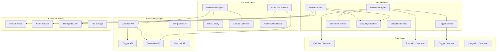
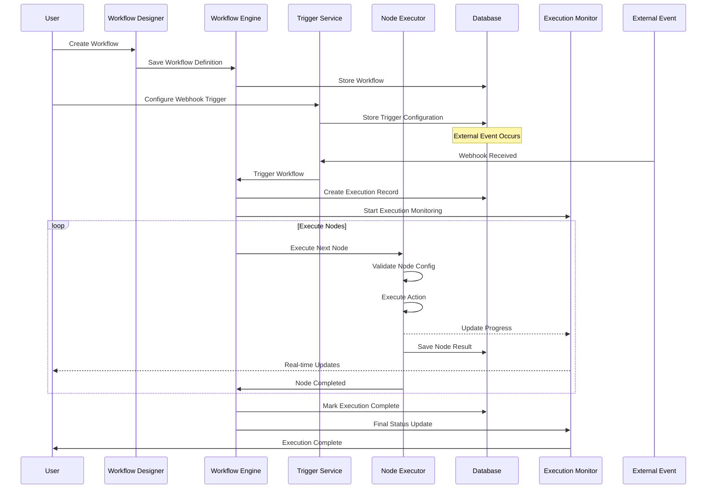
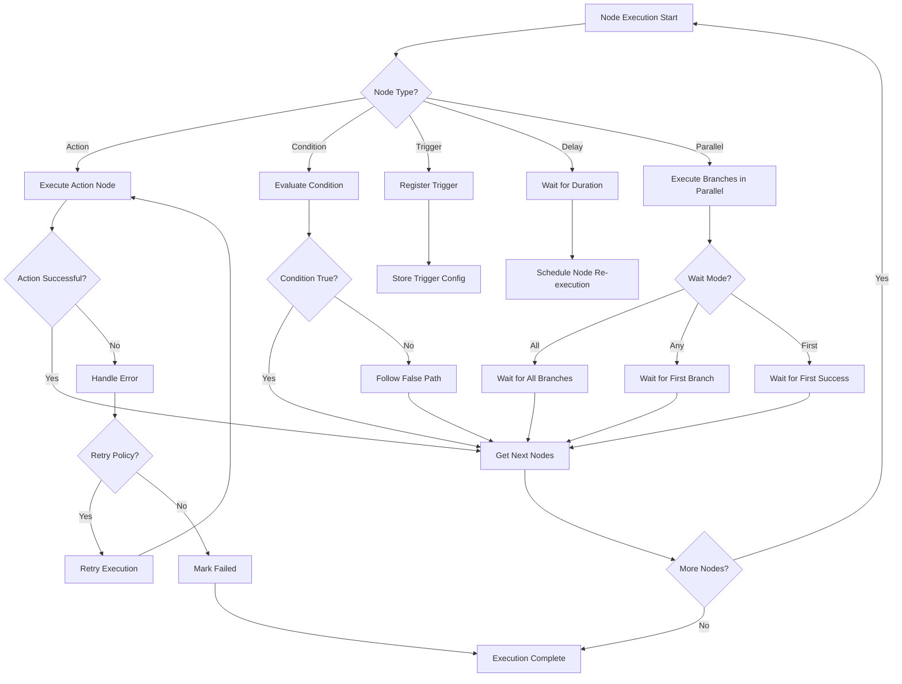
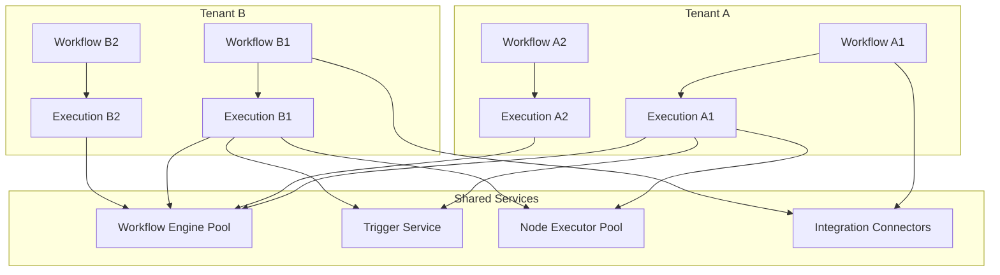
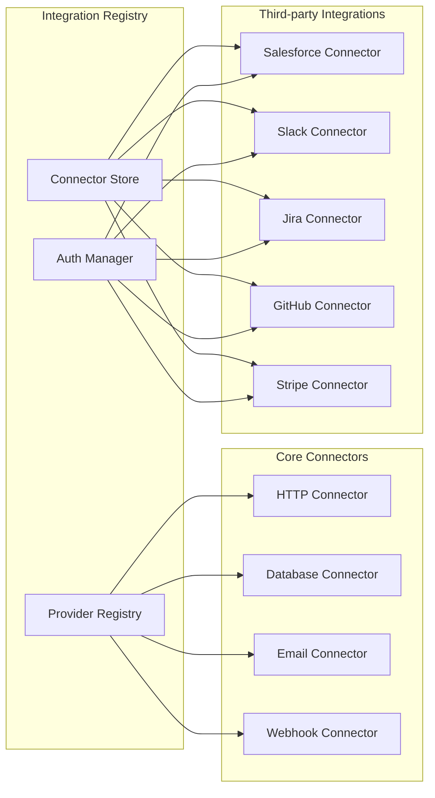
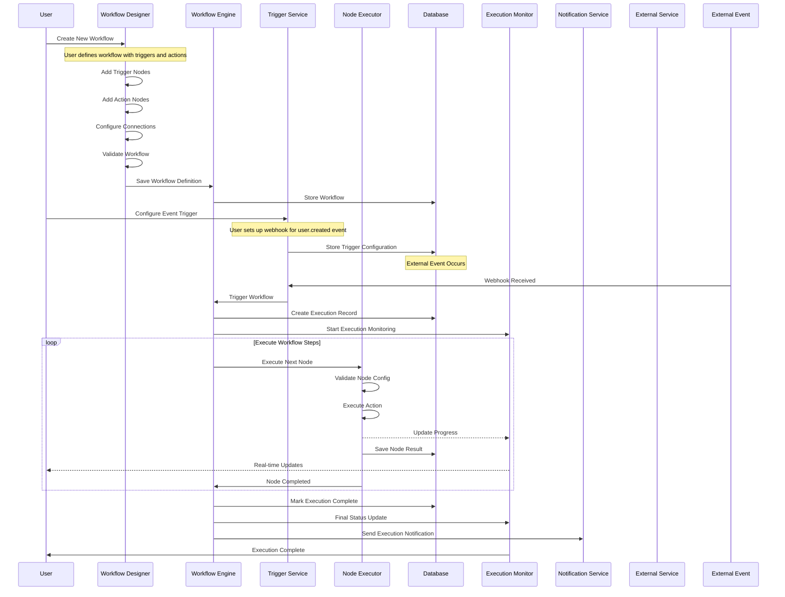
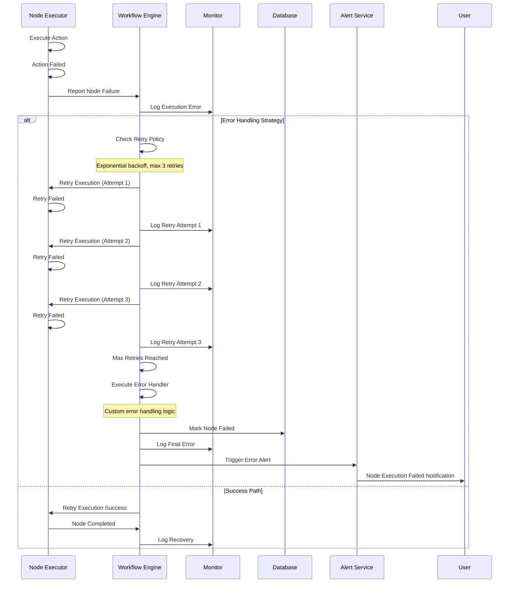

# Workflow Automation - Technical Requirements Document

## Executive Summary

This document outlines the technical requirements for implementing a comprehensive workflow automation system with a visual workflow designer and automated process execution. This feature enables users to create, manage, and execute complex business workflows through an intuitive drag-and-drop interface with support for triggers, actions, conditions, and integrations.

## Phase-Based Implementation Plan

### Phase 1: Foundation & Core Architecture (Weeks 1-4)

#### Week 1-2: Database Schema & Core Models

**Objective**: Establish the data foundation for workflow management

**Database Schema Requirements**:

```sql
-- Core workflow tables
CREATE TABLE workflow (
  id UUID PRIMARY KEY DEFAULT gen_random_uuid(),
  tenant_id UUID NOT NULL REFERENCES tenant(id) ON DELETE CASCADE,
  name VARCHAR(255) NOT NULL,
  description TEXT,
  category VARCHAR(100),

  -- Workflow definition
  definition JSONB NOT NULL, -- Complete workflow graph
  triggers JSONB NOT NULL, -- Event triggers configuration
  settings JSONB, -- Workflow-specific settings

  -- Status & versioning
  status VARCHAR(50) DEFAULT 'draft', -- draft, active, paused, archived
  version VARCHAR(50) DEFAULT '1.0.0',

  -- Execution settings
  timeout INTEGER DEFAULT 3600, -- Timeout in seconds
  retry_policy JSONB, -- Retry configuration
  error_handling JSONB, -- Error handling rules

  -- Metadata
  created_by UUID REFERENCES user(id),
  updated_by UUID REFERENCES user(id),
  created_at TIMESTAMP DEFAULT NOW(),
  updated_at TIMESTAMP DEFAULT NOW(),

  -- Indexes
  INDEX wf_tenant_idx (tenant_id),
  INDEX wf_status_idx (status),
  INDEX wf_category_idx (category),
  UNIQUE wf_tenant_name_idx (tenant_id, name)
);

CREATE TABLE workflow_execution (
  id UUID PRIMARY KEY DEFAULT gen_random_uuid(),
  workflow_id UUID NOT NULL REFERENCES workflow(id) ON DELETE CASCADE,
  tenant_id UUID NOT NULL REFERENCES tenant(id) ON DELETE CASCADE,

  -- Execution context
  triggered_by VARCHAR(100), -- event, manual, scheduled
  triggered_by_id UUID REFERENCES user(id),
  trigger_data JSONB, -- Data that triggered the workflow

  -- Execution state
  status VARCHAR(50) DEFAULT 'running', -- running, completed, failed, cancelled
  current_step VARCHAR(255), -- Currently executing step
  progress INTEGER DEFAULT 0, -- 0-100 percentage

  -- Results
  result JSONB, -- Final output data
  error TEXT, -- Error message if failed
  error_details JSONB, -- Detailed error information

  -- Timing
  started_at TIMESTAMP DEFAULT NOW(),
  completed_at TIMESTAMP,
  duration INTEGER, -- Duration in seconds

  -- Context
  context JSONB, -- Execution context variables
  metadata JSONB,

  -- Indexes
  INDEX we_workflow_id_idx (workflow_id),
  INDEX we_tenant_idx (tenant_id),
  INDEX we_status_idx (status),
  INDEX we_started_at_idx (started_at)
);
```

**Core Service Interfaces**:

```typescript
interface WorkflowDefinition {
  id: string
  tenantId: string
  name: string
  description?: string
  category: string
  definition: WorkflowGraph
  triggers: WorkflowTrigger[]
  status: WorkflowStatus
  settings: WorkflowSettings
  version: string
}

interface WorkflowGraph {
  nodes: WorkflowNode[]
  edges: WorkflowEdge[]
  variables: WorkflowVariable[]
}

interface WorkflowNode {
  id: string
  type: NodeType
  position: { x: number; y: number }
  data: NodeData
  config: NodeConfig
}

interface WorkflowEdge {
  id: string
  source: string
  target: string
  sourceHandle?: string
  targetHandle?: string
  data: EdgeData
  condition?: EdgeCondition
}
```

#### Week 3-4: Core Workflow Engine

**Objective**: Implement the workflow execution engine

**Engine Architecture**:

```typescript
interface WorkflowEngine {
  // Core execution
  executeWorkflow(workflowId: string, triggerData?: any): Promise<WorkflowExecution>
  executeNode(nodeId: string, context: ExecutionContext): Promise<NodeResult>

  // Flow control
  evaluateCondition(condition: EdgeCondition, context: ExecutionContext): Promise<boolean>
  getNextNodes(currentNodeId: string): Promise<string[]>

  // State management
  updateExecutionStatus(executionId: string, status: ExecutionStatus): Promise<void>
  saveExecutionContext(executionId: string, context: ExecutionContext): Promise<void>

  // Error handling
  handleExecutionError(executionId: string, error: Error): Promise<void>
  retryExecution(executionId: string): Promise<void>
}

class NodeExecutor {
  // Action execution
  async executeAction(node: ActionNode, context: ExecutionContext): Promise<ActionResult>

  // Condition evaluation
  async evaluateCondition(node: ConditionNode, context: ExecutionContext): Promise<boolean>

  // Trigger handling
  async registerTrigger(trigger: WorkflowTrigger): Promise<void>
  async unregisterTrigger(triggerId: string): Promise<void>
}
```

**Core Node Types**:

```typescript
enum NodeType {
  TRIGGER = 'trigger',
  ACTION = 'action',
  CONDITION = 'condition',
  DELAY = 'delay',
  PARALLEL = 'parallel',
  MERGE = 'merge',
  WEBHOOK = 'webhook',
  EMAIL = 'email',
  HTTP = 'http',
  DATABASE = 'database',
  TRANSFORM = 'transform',
}

interface ActionNode {
  type: 'send_email' | 'http_request' | 'database_query' | 'webhook' | 'transform_data'
  parameters: Record<string, any>
  retryPolicy?: RetryPolicy
  timeout?: number
}

interface ConditionNode {
  type: 'if' | 'switch' | 'filter' | 'validate'
  conditions: ConditionExpression[]
  defaultPath?: string
}
```

### Phase 2: Visual Workflow Designer (Weeks 5-8)

#### Week 5-6: Canvas & Drag-Drop System

**Objective**: Build the visual workflow editor interface

**Component Architecture**:

```typescript
interface WorkflowCanvas {
  // Canvas configuration
  nodes: WorkflowNode[]
  edges: WorkflowEdge[]
  viewport: ViewportState

  // Interaction handlers
  onNodeAdd: (nodeType: NodeType, position: Point) => void
  onNodeMove: (nodeId: string, position: Point) => void
  onEdgeCreate: (connection: Connection) => void
  onNodeSelect: (nodeId: string) => void

  // Canvas operations
  zoomIn: () => void
  zoomOut: () => void
  fitToScreen: () => void
  centerView: () => void
}

interface NodeComponent {
  // Node rendering
  node: WorkflowNode
  selected: boolean
  dragging: boolean

  // Interaction
  onClick: () => void
  onDoubleClick: () => void
  onDrag: (position: Point) => void
  onConfigure: () => void

  // Handles
  inputHandles: Handle[]
  outputHandles: Handle[]
}
```

**Node Library Components**:

```typescript
interface NodeLibrary {
  categories: NodeCategory[]
  searchNodes: (query: string) => NodeDefinition[]

  // Built-in nodes
  triggerNodes: TriggerNodeDefinition[]
  actionNodes: ActionNodeDefinition[]
  conditionNodes: ConditionNodeDefinition[]
  utilityNodes: UtilityNodeDefinition[]
}

interface NodeDefinition {
  type: string
  category: string
  name: string
  description: string
  icon: React.ComponentType
  color: string

  // Configuration schema
  inputSchema: JSONSchema
  outputSchema: JSONSchema

  // Node properties
  inputs: NodePort[]
  outputs: NodePort[]
  config: NodeConfigDefinition[]
}
```

#### Week 7-8: Node Configuration & Validation

**Objective**: Implement node configuration panels and workflow validation

**Configuration System**:

```typescript
interface NodeConfiguration {
  // Dynamic forms
  nodeType: string
  schema: JSONSchema
  formData: Record<string, any>

  // Validation
  validate: (data: any) => ValidationResult
  errors: ValidationError[]

  // Help system
  documentation: NodeDocumentation
  examples: NodeExample[]
}

interface WorkflowValidator {
  // Structural validation
  validateStructure(workflow: WorkflowGraph): ValidationResult

  // Semantic validation
  validateSemantics(workflow: WorkflowGraph): ValidationResult

  // Performance validation
  validatePerformance(workflow: WorkflowGraph): ValidationResult

  // Security validation
  validateSecurity(workflow: WorkflowGraph): ValidationResult
}
```

### Phase 3: Action Nodes & Integrations (Weeks 9-12)

#### Week 9-10: Core Action Implementations

**Objective**: Implement essential workflow action nodes

**Action Node Types**:

```typescript
// Communication Actions
interface EmailActionNode extends ActionNode {
  type: 'send_email'
  config: {
    to: string[]
    cc?: string[]
    bcc?: string[]
    subject: string
    template?: string
    variables?: Record<string, any>
    attachments?: FileAttachment[]
  }
}

interface WebhookActionNode extends ActionNode {
  type: 'webhook'
  config: {
    url: string
    method: 'GET' | 'POST' | 'PUT' | 'DELETE'
    headers?: Record<string, string>
    body?: any
    auth?: AuthConfig
    timeout?: number
    retries?: number
  }
}

// Data Actions
interface DatabaseActionNode extends ActionNode {
  type: 'database_query'
  config: {
    connection: string
    query: string
    parameters?: Record<string, any>
    action: 'select' | 'insert' | 'update' | 'delete'
    outputFormat?: 'array' | 'object'
  }
}

interface TransformActionNode extends ActionNode {
  type: 'transform_data'
  config: {
    operation: 'map' | 'filter' | 'reduce' | 'aggregate'
    expression: string // JavaScript or expression language
    inputMapping: Record<string, string>
    outputMapping: Record<string, string>
  }
}
```

#### Week 11-12: Integration Nodes

**Objective**: Implement integration nodes for external services

**Integration Framework**:

```typescript
interface IntegrationNode {
  type: 'integration'
  provider: string // salesforce, slack, jira, github, etc.
  action: string
  config: IntegrationConfig

  // Authentication
  auth: {
    type: 'oauth2' | 'api_key' | 'basic'
    credentials: SecureCredential
    scopes?: string[]
  }
}

interface IntegrationRegistry {
  // Provider registry
  providers: Map<string, IntegrationProvider>
  actions: Map<string, IntegrationAction[]>

  // Provider management
  registerProvider(provider: IntegrationProvider): void
  unregisterProvider(providerId: string): void

  // Action discovery
  getProviderActions(providerId: string): IntegrationAction[]
  executeIntegrationAction(actionId: string, config: any): Promise<any>
}
```

### Phase 4: Advanced Features & Triggers (Weeks 13-16)

#### Week 13-14: Trigger System

**Objective**: Implement comprehensive trigger system

**Trigger Types**:

```typescript
interface TriggerRegistry {
  // Trigger management
  triggers: Map<string, TriggerDefinition>
  activeTriggers: Map<string, ActiveTrigger>

  // Trigger operations
  registerTrigger(trigger: TriggerConfig): Promise<string>
  unregisterTrigger(triggerId: string): Promise<void>
  enableTrigger(triggerId: string): Promise<void>
  disableTrigger(triggerId: string): Promise<void>
}

// Event-based triggers
interface EventTrigger extends TriggerConfig {
  type: 'event'
  eventType: string // user.created, order.completed, etc.
  source: string // system, database, external
  conditions?: TriggerCondition[]
  debounce?: number // Debounce in milliseconds
}

// Schedule triggers
interface ScheduleTrigger extends TriggerConfig {
  type: 'schedule'
  schedule: CronExpression
  timezone?: string
  startDate?: Date
  endDate?: Date
}

// Webhook triggers
interface WebhookTrigger extends TriggerConfig {
  type: 'webhook'
  endpoint: string
  method?: string
  authentication?: WebhookAuth
  validation?: WebhookValidation
}
```

#### Week 15-16: Advanced Flow Control

**Objective**: Implement sophisticated flow control mechanisms

**Flow Control Nodes**:

```typescript
// Parallel execution
interface ParallelNode extends WorkflowNode {
  type: 'parallel'
  config: {
    branches: ParallelBranch[]
    waitMode: 'all' | 'any' | 'first'
    timeout?: number
    errorHandling: 'stop' | 'continue' | 'collect'
  }
}

// Conditional routing
interface SwitchNode extends WorkflowNode {
  type: 'switch'
  config: {
    expression: string
    cases: SwitchCase[]
    defaultCase?: string
    variable?: string
  }
}

// Loop constructs
interface LoopNode extends WorkflowNode {
  type: 'loop'
  config: {
    loopType: 'for' | 'while' | 'foreach'
    iterable?: string
    condition?: string
    iterations?: number
    maxIterations?: number
    breakCondition?: string
  }
}

// Sub-workflows
interface SubWorkflowNode extends WorkflowNode {
  type: 'subworkflow'
  config: {
    workflowId: string
    inputMapping: Record<string, string>
    outputMapping: Record<string, string>
    errorHandling: 'propagate' | 'catch' | 'ignore'
  }
}
```

### Phase 5: Execution & Monitoring (Weeks 17-20)

#### Week 17-18: Execution Engine Advanced Features

**Objective**: Enhance workflow execution with advanced features

**Advanced Execution Features**:

```typescript
interface AdvancedWorkflowEngine extends WorkflowEngine {
  // Parallel execution
  executeParallel(nodes: string[], context: ExecutionContext): Promise<ParallelResult[]>

  // Context management
  mergeContexts(contexts: ExecutionContext[]): ExecutionContext
  forkContext(parent: ExecutionContext): ExecutionContext

  // Variable management
  resolveVariable(expression: string, context: ExecutionContext): Promise<any>
  setVariable(name: string, value: any, context: ExecutionContext): Promise<void>

  // Error handling
  catchError(error: WorkflowError, context: ExecutionContext): Promise<ErrorHandlingResult>
  retryExecution(executionId: string, strategy: RetryStrategy): Promise<void>

  // Performance optimization
  optimizeWorkflow(workflow: WorkflowDefinition): WorkflowOptimization
  cacheExecutionResults(key: string, result: any): Promise<void>
  getCachedExecutionResult(key: string): Promise<any>
}
```

**Execution Context System**:

```typescript
interface ExecutionContext {
  // Core context
  executionId: string
  workflowId: string
  tenantId: string

  // State
  variables: Map<string, any>
  history: ExecutionHistory[]

  // Configuration
  settings: ExecutionSettings
  permissions: ExecutionPermissions

  // Runtime
  startTime: Date
  currentNode?: string
  status: ExecutionStatus
  metrics: ExecutionMetrics
}
```

#### Week 19-20: Monitoring & Analytics

**Objective**: Implement comprehensive monitoring and analytics

**Monitoring System**:

```typescript
interface WorkflowMonitoring {
  // Real-time monitoring
  getActiveExecutions(): Promise<WorkflowExecution[]>
  getExecutionMetrics(executionId: string): Promise<ExecutionMetrics>

  // Historical analytics
  getExecutionHistory(filters: ExecutionFilters): Promise<ExecutionHistory[]>
  getWorkflowStatistics(workflowId: string, period: TimePeriod): Promise<WorkflowStats>

  // Performance analytics
  getPerformanceMetrics(workflowId: string): Promise<PerformanceMetrics>
  getBottleneckAnalysis(workflowId: string): Promise<BottleneckReport>

  // Alerting
  setAlert(rule: AlertRule): Promise<string>
  removeAlert(alertId: string): Promise<void>
  checkAlerts(execution: WorkflowExecution): Promise<Alert[]>
}

interface ExecutionMetrics {
  // Timing metrics
  duration: number
  nodeExecutionTimes: Map<string, number>
  waitTimes: Map<string, number>

  // Resource metrics
  memoryUsage: number
  cpuUsage: number
  databaseQueries: number

  // Error metrics
  errorCount: number
  errorRate: number
  retryCount: number

  // Throughput metrics
  executionsPerHour: number
  successRate: number
  averageDuration: number
}
```

### Phase 6: Security & Performance (Weeks 21-24)

#### Week 21-22: Security & Sandboxing

**Objective**: Implement security measures and execution sandboxing

**Security Measures**:

```typescript
interface WorkflowSecurity {
  // Permission system
  checkExecutionPermission(userId: string, workflowId: string): Promise<boolean>
  validateActionPermissions(actionId: string, context: ExecutionContext): Promise<boolean>

  // Code execution sandboxing
  createSandbox(context: ExecutionContext): WorkflowSandbox
  executeInSandbox(code: string, sandbox: WorkflowSandbox): Promise<any>

  // Input validation
  validateInput(data: any, schema: JSONSchema): ValidationResult
  sanitizeInput(data: any): any

  // Data encryption
  encryptSensitiveData(data: any): Promise<string>
  decryptSensitiveData(encryptedData: string): Promise<any>

  // Audit logging
  logSecurityEvent(event: SecurityEvent): Promise<void>
  getSecurityAudit(workflowId: string): Promise<SecurityAudit[]>
}

interface WorkflowSandbox {
  // Resource limits
  maxMemory: number
  maxExecutionTime: number
  allowedDomains: string[]
  blockedAPIs: string[]

  // Execution environment
  execute(code: string, context: ExecutionContext): Promise<any>
  destroy(): void

  // Monitoring
  getResourceUsage(): SandboxMetrics
  checkResourceLimits(): boolean
}
```

#### Week 23-24: Performance Optimization

**Objective**: Optimize workflow performance and scalability

**Performance Optimizations**:

```typescript
interface WorkflowOptimizer {
  // Execution optimization
  optimizeExecutionPlan(workflow: WorkflowDefinition): ExecutionPlan
  optimizeNodeExecution(node: WorkflowNode): OptimizedNode

  // Caching strategies
  cacheNodeResult(nodeId: string, result: any, ttl?: number): Promise<void>
  getCachedNodeResult(nodeId: string): Promise<any>

  // Batch processing
  batchSimilarActions(actions: WorkflowAction[]): Promise<BatchResult>
  optimizeDatabaseQueries(workflow: WorkflowDefinition): OptimizedQueries

  // Resource management
  allocateResources(execution: WorkflowExecution): ResourceAllocation
  releaseResources(executionId: string): Promise<void>
  monitorResourceUsage(): ResourceMetrics
}

interface PerformanceMetrics {
  // System metrics
  throughput: number
  latency: number
  errorRate: number

  // Workflow metrics
  executionTime: number
  resourceUtilization: ResourceUtilization
  bottlenecks: PerformanceBottleneck[]

  // User experience
  responseTime: number
  throughputPerUser: number
  concurrentUsers: number
}
```

### Phase 7: Testing & Documentation (Weeks 25-28)

#### Week 25-26: Testing Framework

**Objective**: Implement comprehensive testing for workflow system

**Testing Requirements**:

```typescript
interface WorkflowTesting {
  // Unit tests
  testNodeExecution(node: WorkflowNode, context: ExecutionContext): Promise<NodeTestResult>
  testConditionEvaluation(
    condition: EdgeCondition,
    context: ExecutionContext
  ): Promise<ConditionTestResult>

  // Integration tests
  testWorkflowExecution(workflow: WorkflowDefinition, testData: any): Promise<WorkflowTestResult>
  testTriggerExecution(trigger: WorkflowTrigger, eventData: any): Promise<TriggerTestResult>

  // Performance tests
  loadTestWorkflow(workflowId: string, concurrency: number): Promise<LoadTestResult>
  stressTestSystem(config: StressTestConfig): Promise<StressTestResult>

  // End-to-end tests
  runE2ETestScenario(scenario: E2ETestScenario): Promise<E2ETestResult>
  validateWorkflowBehavior(workflowId: string): Promise<ValidationResult>
}

interface TestSuites {
  // Node test suites
  actionNodeTests: ActionNodeTestSuite[]
  triggerNodeTests: TriggerNodeTestSuite[]
  conditionNodeTests: ConditionNodeTestSuite[]

  // Integration test suites
  workflowIntegrationTests: WorkflowIntegrationTestSuite[]
  apiIntegrationTests: APIIntegrationTestSuite[]

  // Performance test suites
  performanceTestSuite: PerformanceTestSuite[]
  scalabilityTestSuite: ScalabilityTestSuite[]
}
```

#### Week 27-28: Documentation & Training

**Objective**: Create comprehensive documentation and training materials

**Documentation Requirements**:

```typescript
interface DocumentationSystem {
  // User documentation
  userGuide: UserGuide
  apiReference: APIReference
  tutorialCollection: TutorialCollection

  // Developer documentation
  developerGuide: DeveloperGuide
  integrationGuide: IntegrationGuide
  extendingGuide: ExtendingGuide

  // Admin documentation
  adminGuide: AdminGuide
  securityGuide: SecurityGuide
  troubleshootingGuide: TroubleshootingGuide
}

interface TrainingMaterials {
  // Video tutorials
  gettingStartedVideos: VideoTutorial[]
  advancedFeatureVideos: VideoTutorial[]
  bestPracticeVideos: VideoTutorial[]

  // Interactive tutorials
  guidedWorkflows: GuidedWorkflow[]
  interactiveExercises: InteractiveExercise[]

  // Certification materials
  certificationExam: CertificationExam
  practiceScenarios: PracticeScenario[]
}
```

## Technical Requirements Summary

### Architecture Requirements

- **Microservices Architecture**: Separate workflow engine, trigger service, and monitoring
- **Event-Driven**: Use event bus for workflow communication
- **Scalable Design**: Support for 1000+ concurrent workflow executions
- **Fault Tolerant**: Graceful error handling and retry mechanisms
- **Secure Execution**: Sandboxed code execution with resource limits

### Performance Requirements

- **Response Time**: <100ms for workflow designer interactions
- **Execution Throughput**: Support 100+ concurrent executions
- **Resource Efficiency**: <1GB memory per workflow execution
- **Database Performance**: <50ms query times for workflow data
- **Scalability**: Horizontal scaling capability

### Integration Requirements

- **API Integration**: RESTful API for all workflow operations
- **Third-Party Connectors**: Pre-built connectors for popular services
- **Webhook Support**: Inbound webhook triggers and actions
- **Authentication**: OAuth2, API keys, and custom auth methods
- **Data Transformation**: JSON transformation and mapping capabilities

### Security Requirements

- **Role-Based Access**: Granular permissions for workflow operations
- **Code Sandboxing**: Secure execution of custom code
- **Input Validation**: Comprehensive data validation and sanitization
- **Audit Logging**: Complete audit trail for all workflow activities
- **Encryption**: Encrypted storage of sensitive workflow data

### User Experience Requirements

- **Intuitive Interface**: Drag-and-drop workflow designer
- **Real-Time Updates**: Live execution status and progress
- **Visual Feedback**: Clear error messages and validation feedback
- **Mobile Support**: Responsive design for mobile devices
- **Accessibility**: WCAG 2.1 AA compliance

## Success Metrics

### Technical Success Criteria

- [ ] 10,000+ workflows created by users
- [ ] 100,000+ workflow executions per month
- [ ] <500ms average execution time
- [ ] 99.9% workflow execution success rate
- [ ] <1 minute average workflow design time

### Business Success Criteria

- [ ] 50% reduction in manual process time
- [ ] 80% user adoption rate for automated workflows
- [ ] 30% improvement in process efficiency
- [ ] 90% user satisfaction rating
- [ ] 25% reduction in operational costs

### Security Success Criteria

- [ ] Zero security vulnerabilities in execution engine
- [ ] 100% audit trail coverage
- [ ] <1 second security breach detection time
- [ ] 100% compliance with data protection regulations
- [ ] Zero data leakage incidents

## System Architecture Diagrams

### Workflow System Architecture



### Workflow Execution Flow



### Decision Tree for Node Execution



### Multi-tenant Workflow Architecture



### Integration Platform Architecture



## Appendix: Non-Functional Requirements

### Performance Requirements

- **Workflow Designer Responsiveness**

  - Canvas rendering: 60fps at 1000+ nodes
  - Drag-and-drop latency: <16ms
  - Real-time collaboration: <100ms sync delay
  - Memory usage: <200MB for complex workflows

- **Execution Engine Performance**

  - Concurrent executions: 1000+ workflows
  - Node execution latency: <10ms average
  - Workflow startup time: <50ms
  - Resource utilization: <80% CPU, <2GB RAM per 100 executions

- **Database Performance**
  - Query response time: <50ms for workflow data
  - Insert throughput: 10,000+ executions/second
  - Index optimization for tenant isolation
  - Connection pooling: 100+ concurrent connections

### Scalability Requirements

- **Horizontal Scaling**

  - Auto-scaling based on execution queue length
  - Load balancing across workflow engine instances
  - Database sharding by tenant
  - CDN distribution for static assets

- **Vertical Scaling**
  - Memory allocation per workflow: 1GB base + 100MB per 100 nodes
  - CPU allocation: 0.5 cores per concurrent execution
  - Storage scaling: 1TB per 10,000 workflows
  - Network bandwidth: 1Gbps per 1000 executions

### Security Requirements

- **Authentication & Authorization**

  - Multi-factor authentication for admin access
  - Role-based access control (RBAC) with 5+ granular permissions
  - OAuth2 integration for third-party services
  - API key management with rotation policies

- **Data Protection**

  - Encryption at rest and in transit (AES-256)
  - PII data masking in logs and exports
  - Data retention policies (configurable per tenant)
  - GDPR and CCPA compliance measures

- **Code Execution Security**
  - Sandboxed JavaScript execution with resource limits
  - Whitelisted APIs and modules for custom code
  - Timeout enforcement for all node executions
  - Memory and CPU usage monitoring

### Reliability Requirements

- **High Availability**

  - 99.9% uptime SLA for workflow services
  - Automatic failover for critical components
  - Multi-region deployment capability
  - Disaster recovery time <4 hours (RTO)

- **Error Handling**

  - Comprehensive retry policies with exponential backoff
  - Dead letter queue for failed executions
  - Circuit breaker pattern for external integrations
  - Graceful degradation under load

- **Data Consistency**
  - ACID compliance for workflow state changes
  - Eventual consistency for distributed components
  - Conflict resolution for concurrent modifications
  - Audit trail for all state transitions

### Usability Requirements

- **User Interface**

  - Responsive design for desktop, tablet, and mobile
  - Keyboard accessibility (WCAG 2.1 AA)
  - Screen reader compatibility
  - High contrast mode support

- **Learning Curve**

  - Time to first workflow: <15 minutes for basic users
  - Advanced feature discovery: <1 hour for power users
  - Interactive tutorials and tooltips
  - Contextual help system

- **Collaboration**
  - Real-time multi-user workflow editing
  - Conflict resolution for concurrent changes
  - Version control with branching
  - Comments and annotation system

### Integration Requirements

- **API Standards**

  - RESTful API with OpenAPI 3.0 specification
  - GraphQL endpoint for complex queries
  - Webhook delivery with retry logic
  - Event streaming for real-time updates

- **Connector Ecosystem**

  - 50+ pre-built connectors for popular services
  - Custom connector development kit
  - Connector marketplace with ratings and reviews
  - Community contribution framework

- **Extensibility**
  - Plugin architecture for custom nodes
  - Custom action development in JavaScript/TypeScript
  - Event system for hooking into workflow lifecycle
  - Configuration schema validation

### Monitoring & Observability

- **Metrics Collection**

  - Real-time execution metrics dashboard
  - Performance bottleneck detection
  - Resource usage monitoring per tenant
  - Business KPI tracking and reporting

- **Logging & Tracing**

  - Structured logging with correlation IDs
  - Distributed tracing across service boundaries
  - Error aggregation and alerting
  - Log retention policies and archival

- **Alerting**
  - Configurable alert rules with multiple channels
  - SLA breach notifications
  - Anomaly detection with machine learning
  - Escalation policies for critical issues

### Compliance & Governance

- **Audit Requirements**

  - Immutable audit trail for all workflow activities
  - Electronic signature for workflow approvals
  - Compliance reporting templates
  - Data export in standard formats (JSON, CSV, PDF)

- **Regulatory Compliance**
  - SOC 2 Type II compliance controls
  - ISO 27001 information security management
  - HIPAA compliance for healthcare workflows
  - Industry-specific compliance modules

### Workflow Execution Sequence Diagrams

### End-to-End Workflow Execution



### Error Handling and Retry Flow



### Multi-Tenant Workflow Isolation

```mermaid
sequenceDiagram
    participant UserA as User_A
    participant UserB as User_B
    participant TenantA as Tenant_A_Workflow
    participant TenantB as Tenant_B_Workflow
    participant Engine as Workflow Engine
    participant Isolation as Tenant Isolation

    UserA->>TenantA: Create Workflow A
    Note over TenantA: Workflow scoped to Tenant A
    TenantA->>Engine: Submit Workflow A
    Engine->>Isolation: Validate Tenant Access

    UserB->>TenantB: Create Workflow B
    Note over TenantB: Workflow scoped to Tenant B
    TenantB->>Engine: Submit Workflow B
    Engine->>Isolation: Validate Tenant Access

    par Concurrent Execution
        Engine->>TenantA: Execute Workflow A
        Note over TenantA: Isolated execution context
        Isolation->>TenantA: Create Tenant A Sandbox
        Isolation->>TenantA: Set Resource Limits (1GB RAM)
        Isolation->>TenantA: Execute Nodes in Sandbox
        Isolation->>TenantA: Monitor Resource Usage
        Isolation->>TenantA: Collect Execution Metrics
        TenantA->>Engine: Workflow A Complete
        Isolation->>TenantA: Cleanup Tenant A Sandbox

        Engine->>TenantB: Execute Workflow B
        Note over TenantB: Isolated execution context
        Isolation->>TenantB: Create Tenant B Sandbox
        Isolation->>TenantB: Set Resource Limits (1GB RAM)
        Isolation->>TenantB: Execute Nodes in Sandbox
        Isolation->>TenantB: Monitor Resource Usage
        Isolation->>TenantB: Collect Execution Metrics
        TenantB->>Engine: Workflow B Complete
        Isolation->>TenantB: Cleanup Tenant B Sandbox
    and

    Engine->>Engine: Consolidate Execution Results
    Engine->>Engine: Apply Tenant-specific Analytics
    Engine->>Engine: Generate Isolation Report
```

## Appendix: Use Cases and Personas

### User Personas

#### 1. Business User (Primary Workflow Creator)

**Profile**: Non-technical business user who needs to automate business processes

**Goals**:

- Reduce manual data entry and repetitive tasks
- Automate approval workflows and notifications
- Create reports and analytics dashboards
- Integrate existing business applications

**Skill Level**: Beginner to Intermediate
**Usage Patterns**:

- Uses visual workflow designer with drag-and-drop
- Relies on pre-built templates and connectors
- Focuses on business logic rather than technical implementation

**Key Requirements**:

- Intuitive visual interface with minimal learning curve
- Rich library of business-focused templates
- Guided workflow creation with best practices
- Real-time execution monitoring with business metrics
- Mobile-responsive design for on-the-go access

#### 2. Power User (Advanced Workflow Architect)

**Profile**: Technical user who builds complex, custom workflows

**Goals**:

- Create sophisticated multi-branch workflows
- Implement custom code and complex logic
- Optimize performance and resource usage
- Build integration with multiple systems
- Monitor and fine-tune workflow performance

**Skill Level**: Advanced to Expert
**Usage Patterns**:

- Uses advanced features like parallel execution and custom scripting
- Creates complex conditional logic and error handling
- Builds integration connectors and custom nodes
- Monitors and optimizes workflow performance

**Key Requirements**:

- Advanced workflow designer with code editor
- Performance monitoring and optimization tools
- API access for programmatic workflow management
- Custom node development framework
- Advanced debugging and testing capabilities

#### 3. Administrator (System Manager)

**Profile**: IT administrator managing the workflow system

**Goals**:

- Manage users, permissions, and resource allocation
- Monitor system performance and security
- Configure integrations and connectors
- Ensure compliance and audit requirements

**Skill Level**: Intermediate to Advanced
**Usage Patterns**:

- Accesses admin dashboard and system configuration
- Manages tenant hierarchy and user access
- Monitors execution metrics and system health
- Configures security policies and compliance rules

**Key Requirements**:

- Comprehensive admin dashboard with role-based access
- Multi-tenant management with hierarchy support
- Security and compliance monitoring tools
- Resource allocation and performance management
- Audit logging and reporting capabilities

#### 4. Developer (Integration Specialist)

**Profile**: Software developer extending the workflow platform

**Goals**:

- Create custom nodes and connectors
- Build integration with external systems
- Extend workflow engine capabilities
- Contribute to platform ecosystem

**Skill Level**: Expert
**Usage Patterns**:

- Uses developer SDK and APIs
- Creates custom node types and actions
- Builds integration connectors
- Contributes to marketplace and community

**Key Requirements**:

- Comprehensive developer SDK with documentation
- Extensible architecture for custom nodes
- API-first design for all platform features
- Testing and debugging tools for development
- Marketplace and contribution framework

### Use Case Scenarios

#### 1. Employee Onboarding Workflow

**Persona**: Business User (HR Manager)

**Scenario**: Automated new employee onboarding process

**Workflow Steps**:

1. **Trigger**: Employee record created in HR system
2. **Data Collection**: Fetch employee details from HR database
3. **Account Creation**: Create accounts in various systems (email, Slack, project management)
4. **Access Assignment**: Assign role-based permissions in different systems
5. **Welcome Sequence**: Send welcome emails and schedule orientation
6. **Training Assignment**: Enroll in required training courses
7. **Equipment Request**: Trigger equipment request process
8. **Manager Notification**: Notify manager of onboarding completion
9. **Documentation**: Generate onboarding checklist and reports

**Business Value**:

- Reduces onboarding time from 2 days to 4 hours
- Eliminates manual errors and missed steps
- Improves new employee experience
- Provides visibility into onboarding process

#### 2. Invoice Processing Automation

**Persona**: Business User (Accounting Manager)

**Scenario**: Automated invoice approval and payment processing

**Workflow Steps**:

1. **Trigger**: New invoice submitted
2. **Validation**: Check invoice data against business rules
3. **Route to Approver**: Send to appropriate approver based on amount
4. **Approval Process**: Handle multi-level approval for high-value invoices
5. **Payment Processing**: Process payment through various gateways
6. **Accounting Update**: Update accounting system records
7. **Notification**: Send notifications to vendor and internal teams
8. **Archival**: Archive processed documents
9. **Reporting**: Generate processing reports and analytics

**Business Value**:

- Reduces invoice processing time by 70%
- Improves cash flow management
- Provides audit trail for compliance
- Reduces manual errors and processing costs

#### 3. Customer Support Ticket Escalation

**Persona**: Business User (Support Manager)

**Scenario**: Automated customer support escalation and resolution

**Workflow Steps**:

1. **Trigger**: High-priority ticket created or customer complaint
2. **Triage**: Automatically categorize and prioritize ticket
3. **Assignment**: Route to appropriate support agent based on skills
4. **Escalation Check**: Check if escalation criteria met
5. **Manager Notification**: Notify support manager of escalation
6. **Resource Allocation**: Assign additional resources if needed
7. **SLA Monitoring**: Monitor response times against SLA requirements
8. **Customer Communication**: Send automated updates to customer
9. **Resolution Tracking**: Track resolution steps and collect feedback
10. **Closure**: Generate resolution report and satisfaction survey

**Business Value**:

- Improves response times by 40%
- Ensures consistent escalation handling
- Provides better customer experience
- Generates valuable insights for process improvement

#### 4. IT Infrastructure Provisioning

**Persona**: Power User (DevOps Engineer)

**Scenario**: Automated infrastructure provisioning for new services

**Workflow Steps**:

1. **Trigger**: Service deployment request
2. **Resource Planning**: Calculate required infrastructure resources
3. **Provisioning**: Create cloud resources (VMs, databases, networks)
4. **Configuration**: Apply infrastructure-as-code templates
5. **Security Setup**: Configure security groups and firewall rules
6. **Monitoring Setup**: Deploy monitoring and logging agents
7. **Integration**: Connect to existing IT systems
8. **Testing**: Run automated smoke tests and validation
9. **Documentation**: Generate infrastructure documentation
10. **Handover**: Notify teams of provisioning completion

**Technical Requirements**:

- Integration with cloud providers (AWS, Azure, GCP)
- Infrastructure-as-code support (Terraform, CloudFormation)
- Automated testing and validation frameworks
- Security compliance and monitoring
- Resource cost optimization
- Multi-cloud support for redundancy

#### 5. E-commerce Order Fulfillment

**Persona**: Business User (Operations Manager)

**Scenario**: Automated e-commerce order processing and fulfillment

**Workflow Steps**:

1. **Trigger**: New order received
2. **Order Validation**: Validate inventory, payment, and shipping information
3. **Fraud Check**: Run automated fraud detection
4. **Inventory Check**: Verify product availability and reserve items
5. **Payment Processing**: Process payment and update order status
6. **Warehouse Integration**: Send order to warehouse management system
7. **Shipping**: Generate shipping labels and schedule pickup
8. **Customer Communication**: Send order confirmation and shipping updates
9. **Inventory Update**: Update inventory levels in real-time
10. **Returns Processing**: Handle return requests and process refunds
11. **Documentation**: Generate order documentation and reports

**Integration Requirements**:

- E-commerce platform integration (Shopify, Magento, etc.)
- Payment gateway integration
- Warehouse management system integration
- Shipping carrier integration
- Inventory management system
- Customer communication platform
- Analytics and reporting system

#### 6. Compliance Reporting Workflow

**Persona**: Administrator (Compliance Officer)

**Scenario**: Automated regulatory compliance reporting

**Workflow Steps**:

1. **Trigger**: Scheduled monthly/quarterly reporting
2. **Data Collection**: Gather data from multiple systems
3. **Validation**: Validate data against compliance requirements
4. **Report Generation**: Generate compliance reports in required formats
5. **Review Process**: Route to compliance officer for review
6. **Approval**: Handle multi-level approval for different compliance areas
7. **Submission**: Submit reports to regulatory bodies
8. **Documentation**: Maintain audit trail of all submissions
9. **Follow-up**: Track regulatory responses and requirements
10. **Alerting**: Send alerts for compliance issues or changes

**Compliance Areas**:

- GDPR data protection reporting
- SOC 2 Type II control testing
- HIPAA healthcare compliance (if applicable)
- Financial industry regulations (if applicable)
- Internal policy compliance monitoring

### Technical Implementation Requirements

#### 1. Persona-Specific UI/UX Requirements

**Business User Interface**:

- Simplified drag-and-drop designer with visual templates
- Business-focused terminology and workflows
- Guided workflow creation with step-by-step assistance
- Real-time execution monitoring with business metrics dashboard
- Mobile-responsive design for on-the-go access

**Power User Interface**:

- Advanced workflow designer with code editor
- Performance profiling and optimization tools
- API documentation and testing interface
- Custom node development environment
- Advanced error handling and retry configuration

**Administrator Interface**:

- Comprehensive admin dashboard with multi-tenant management
- User management with role-based access control
- System monitoring and security management
- Resource allocation and performance management
- Audit logging and compliance reporting capabilities

**Developer Interface**:

- Developer SDK with comprehensive documentation
- API explorer and testing tools
- Custom node development framework
- Integration connector development tools
- Contribution and marketplace management

#### 2. Workflow Template Requirements by Use Case

**Onboarding Templates**:

- Employee onboarding checklist
- Equipment request and approval
- Training assignment and tracking
- Manager notification and reporting
- Documentation generation

**Invoice Processing Templates**:

- Invoice validation and approval workflows
- Multi-level approval routing
- Payment processing automation
- Accounting system integration
- Vendor communication templates

**Support Ticket Templates**:

- Ticket triage and assignment workflows
- Escalation criteria and processes
- SLA monitoring and alerting
- Customer communication automation
- Resolution tracking and feedback collection

**Infrastructure Templates**:

- Cloud resource provisioning workflows
- Security configuration templates
- Monitoring and logging setup
- Multi-cloud deployment patterns
- Cost optimization workflows

#### 3. Integration Requirements Matrix

| Use Case       | HR System | Payment | Shipping | Inventory | Communication | Monitoring |
| -------------- | --------- | ------- | -------- | --------- | ------------- | ---------- | --- |
| Onboarding     | ✓         |         |          |           | ✓             |            |     |
| Invoice        |           | ✓       |          |           | ✓             |            |
| Support        |           |         |          |           | ✓             | ✓          | ✓   |
| Infrastructure |           |         |          |           |               |            | ✓   |
| E-commerce     | ✓         | ✓       | ✓        | ✓         | ✓             | ✓          |

#### 4. Success Metrics by Use Case

| Use Case       | Key Metrics       | Target Values |
| -------------- | ----------------- | ------------- |
| Onboarding     | Time to complete  | <4 hours      |
| Invoice        | Processing time   | <2 hours      |
| Support        | Response time     | <1 hour       |
| Infrastructure | Provisioning time | <30 minutes   |
| E-commerce     | Order to ship     | <24 hours     |

#### 5. Security and Compliance Requirements

| Requirement          | Onboarding | Invoice | Support | Infrastructure |
| -------------------- | ---------- | ------- | ------- | -------------- | --- |
| Data Encryption      | ✓          | ✓       | ✓       | ✓              |
| Audit Trail          | ✓          | ✓       | ✓       | ✓              |
| Role-Based Access    | ✓          | ✓       | ✓       | ✓              |
| Compliance Reporting |            |         | ✓       | ✓              | ✓   |

This comprehensive workflow automation system will provide enterprise-grade capabilities for creating, managing, and executing complex business processes through an intuitive visual interface while maintaining security, performance, and scalability standards.

---

## 🚀 **Implementation Roadmap**

### **Phase 1: Core Foundation (Weeks 1-6)**

#### **Week 1-2: Backend Foundation**

- [ ] **Database Setup**

  - Initialize core tables (workflows, executions, steps, conditions)
  - Implement Row-Level Security (RLS) policies
  - Create database migrations
  - Set up Redis cache for session management

- [ ] **Core Services Architecture**
  - Implement WorkflowEngine service
  - Create ExecutionTracker service
  - Build StepExecutor service
  - Set up service registry and mesh

#### **Week 3-4: Execution Engine**

- [ ] **Basic Workflow Execution**

  - Implement sequential execution
  - Add basic step types (data entry, document generation)
  - Create execution logging and tracking
  - Build error handling and recovery

- [ ] **Decision Logic**
  - Implement basic conditional routing
  - Create decision tree evaluator
  - Add simple branch execution logic

#### **Week 5-6: API Foundation**

- [ ] **RESTful APIs**

  - Workflow CRUD operations
  - Execution management endpoints
  - User management APIs
  - Basic RBAC implementation

- [ ] **Authentication & Authorization**
  - JWT token management
  - Role-based access control
  - Multi-tenant data isolation
  - API security middleware

### **Phase 2: Advanced Features (Weeks 7-12)**

#### **Week 7-8: Advanced Execution**

- [ ] **Parallel Processing**

  - Implement parallel branch execution
  - Add synchronization points
  - Create resource pool management
  - Performance optimization for concurrent executions

- [ ] **Loop Management**
  - Implement for-each loops over collections
  - Add while/until conditional loops
  - Create loop iteration tracking
  - Add loop exit conditions and limits

#### **Week 9-10: Integration Platform**

- [ ] **Connector Framework**

  - Build OAuth 2.0 flow handlers
  - Create webhook management system
  - Implement REST API connectors
  - Add rate limiting and retry logic

- [ ] **Built-in Integrations**
  - Email service integration (SMTP/SendGrid)
  - Document storage (AWS S3/Google Drive)
  - Calendar integrations (Google/Outlook)
  - Communication platforms (Slack/Teams)

#### **Week 11-12: Monitoring & Analytics**

- [ ] **Business Intelligence**

  - Real-time execution dashboard
  - Performance metrics collection
  - Audit trail system
  - Report generation engine

- [ ] **System Monitoring**
  - Application performance monitoring
  - Database query optimization
  - Resource usage tracking
  - Automated alerting system

### **Phase 3: Visual Designer (Weeks 13-18)**

#### **Week 13-14: Canvas Foundation**

- [ ] **Drag & Drop System**

  - Implement HTML5 drag and drop API
  - Create grid-based canvas system
  - Add snap-to-grid functionality
  - Build connection point system

- [ ] **Component Library**
  - Create step component types
  - Implement connection system
  - Add component property panels
  - Build component validation

#### **Week 15-16: Workflow Builder**

- [ ] **Visual Workflow Creation**

  - Drag-and-drop step placement
  - Visual connection creation
  - Inline property editing
  - Real-time validation

- [ ] **User Experience**
  - Keyboard shortcuts and navigation
  - Undo/redo functionality
  - Auto-save and version control
  - Collaboration features

#### **Week 17-18: Advanced Designer Features**

- [ ] **Complex Flow Control**

  - Visual decision tree builder
  - Parallel branch designer
  - Loop configuration interface
  - Sub-workflow embedding

- [ ] **Testing & Debugging**
  - Workflow test runner
  - Step-by-step execution debugging
  - Variable inspection tools
  - Performance profiling

### **Phase 4: Enterprise Features (Weeks 19-24)**

#### **Week 19-20: Multi-Tenant Hierarchy**

- [ ] **Hierarchical System**

  - Parent-child tenant relationships
  - Inheritance engine implementation
  - Permission propagation system
  - Audit trail for hierarchy changes

- [ ] **Advanced RBAC**
  - Granular permission system
  - Role inheritance from parent
  - Override capabilities
  - Permission conflict resolution

#### **Week 21-22: Advanced Security**

- [ ] **Sandbox & Compliance**

  - Code execution sandboxing
  - Input validation and sanitization
  - GDPR compliance features
  - SOC 2 audit preparation

- [ ] **Enterprise Integrations**
  - SSO (SAML/OIDC) implementation
  - Advanced API management
  - Webhook security enhancements
  - Data encryption at rest and transit

#### **Week 23-24: Performance & Scalability**

- [ ] **Load Optimization**

  - Database query optimization
  - Connection pooling implementation
  - Caching strategies
  - Horizontal scaling preparation

- [ ] **Advanced Monitoring**
  - Distributed tracing
  - Advanced error tracking
  - Predictive analytics
  - Automated optimization suggestions

### **Phase 5: Testing & Deployment (Weeks 25-28)**

#### **Week 25-26: Comprehensive Testing**

- [ ] **Quality Assurance**

  - Unit test coverage (>95%)
  - Integration testing suite
  - E2E2 testing implementation
  - End-to-end user scenario testing

- [ ] **Performance Testing**
  - Load testing (1000+ concurrent)
  - Stress testing scenarios
  - Database performance testing
  - Memory usage optimization

#### **Week 27-28: Production Readiness**

- [ ] **Deployment Infrastructure**

  - CI/CD pipeline setup
  - Container orchestration (Kubernetes)
  - Environment configuration management
  - Monitoring and alerting setup

- [ ] **Documentation & Training**
  - Technical documentation completion
  - User guides and tutorials
  - API documentation
  - Admin training materials

---

## 📋 **Development Guidelines**

### **Code Standards**

```typescript
// Example coding standards for workflow engine
interface WorkflowStep {
  id: string
  type: 'data-entry' | 'document-gen' | 'decision' | 'integration'
  name: string
  description?: string
  config: Record<string, unknown>
  position?: { x: number; y: number }
  nextSteps?: string[]
  parallelGroups?: string[]
}

interface WorkflowExecution {
  id: string
  workflowId: string
  status: 'pending' | 'running' | 'completed' | 'failed' | 'cancelled'
  currentStep?: string
  data: Record<string, unknown>
  variables: Record<string, unknown>
  startTime: Date
  endTime?: Date
  error?: string
}
```

### **API Design Patterns**

- RESTful endpoints with proper HTTP methods
- Consistent response formats
- Comprehensive error handling
- Rate limiting and throttling
- API versioning strategy

### **Database Best Practices**

- Proper indexing strategy
- Query optimization
- Connection pooling
- Migration management
- Backup and recovery procedures

### **Security Checklist**

- Input validation and sanitization
- SQL injection prevention
- XSS protection
- CSRF tokens
- Secure headers implementation
- Dependency vulnerability scanning

---

## 🎯 **Success Metrics & KPIs**

### **Development Metrics**

- [ ] Code coverage: >95%
- [ ] API response time: <100ms (95th percentile)
- [ ] Database query time: <50ms average
- [ ] Build time: <5 minutes
- [ ] Test execution time: <10 minutes

### **Performance Targets**

- [ ] Concurrent executions: 1000+
- [ ] Workflow creation time: <30 seconds
- [ ] Canvas rendering: 60fps
- [ ] Memory usage: <512MB per instance
- [ ] CPU usage: <70% under load

### **Quality Indicators**

- [ ] Zero critical security vulnerabilities
- [ ] <1% error rate in production
- [ ] 99.9% uptime SLA
- [ ] Customer satisfaction: >4.5/5
- [ ] Time-to-resolution: <4 hours

---

## 🔄 **Maintenance & Evolution**

### **Continuous Improvement**

- Weekly performance reviews
- Monthly security audits
- Quarterly architecture assessments
- Annual scalability planning
- User feedback integration cycles

### **Monitoring Strategy**

- Real-time performance dashboards
- Automated error tracking
- User behavior analytics
- System health monitoring
- Business impact metrics

### **Future Roadmap**

- AI-powered workflow recommendations
- Advanced process mining capabilities
- Mobile application development
- Advanced analytics and ML insights
- Industry-specific workflow templates

This comprehensive implementation roadmap provides a structured approach to building the workflow automation system while ensuring quality, security, and performance throughout the development lifecycle.
